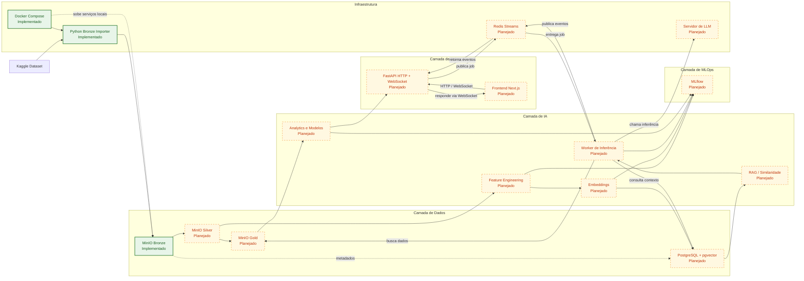
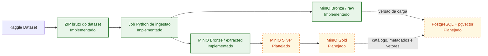
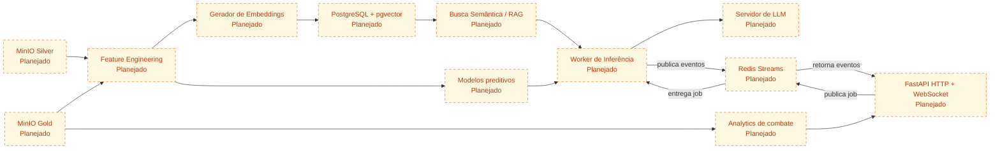
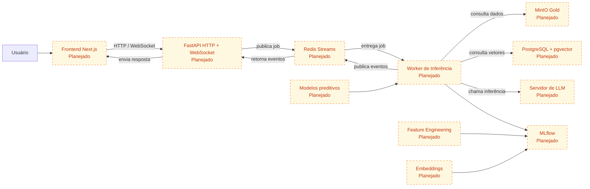

# RAG INTELLIGENCE

- Pedro Henrique Andrade Siqueira - 222471
- Enzo Cambraia - 223335
- Lucas Siqueira Gonçalves - 212138
- Tales Augusto Sartório Furlan - 212170
- João Vitor Wenceslau Campagnin - 222225
- José Antonio Classio Jr - 223663
- Thiago de Lima Santos- 223628
- Enzo Murat Aires de Alencar - 212189
- Luis Augusto Machado Oliveira - 223360
- Gustavo Sinto Botejara - 223257

# Product Backlog — CS:GO Analytics AI

## DataSet

[https://www.kaggle.com/datasets/skihikingkevin/csgo-matchmaking-damage](https://www.kaggle.com/datasets/skihikingkevin/csgo-matchmaking-damage)

## Arquitetura Geral

O sistema alvo do projeto é organizado em cinco camadas:

- **Dados**: ingestão do dataset externo, armazenamento em Data Lake e persistência de metadados e vetores.
- **IA**: preparação de features, geração de embeddings, recuperação semântica, inferência assíncrona, analytics e modelos preditivos.
- **Aplicação**: API para consulta dos eventos, gateway WebSocket e frontend web para visualização dos resultados.
- **MLOps**: rastreamento de experimentos, métricas e versionamento de modelos.
- **Infraestrutura**: execução local e orquestração dos serviços de dados e aplicação.

### Blocos Arquiteturais

- **Fonte externa**: Kaggle como origem do dataset `csgo-matchmaking-damage`.
- **Camada de Dados**: MinIO como Data Lake em estágios Bronze, Silver e Gold; PostgreSQL com extensão pgvector para metadados, versionamento e indexação vetorial. O PostgreSQL com pgvector é store relacional e vetorial, não broker de mensageria.
- **Camada de IA**: pipelines de feature engineering, geração de embeddings, recuperação por similaridade/RAG, worker de inferência assíncrona e modelos preditivos.
- **Camada de Aplicação**: FastAPI para expor endpoints HTTP e WebSocket e atuar como gateway do frontend; Next.js como cliente web.
- **Serviços de Suporte**: Redis Streams como barramento interno de jobs e eventos entre FastAPI e workers; servidor de LLM como dependência interna chamada pelo worker de inferência.
- **Camada de MLOps**: MLflow para registrar experimentos, métricas e versões de modelos.
- **Infraestrutura**: Docker Compose como orquestração local e job Python para a carga inicial da Bronze.

### Legenda

- `[Implementado]`: componente já existente no repositório ou validado localmente.
- `[Planejado]`: componente previsto no backlog, mas ainda não implementado.

### Visão Macro da Arquitetura



### Pipeline de Dados



### Pipeline de IA e RAG



### Fluxo de Aplicação e MLOps



### Estado Atual

- **Implementado**: PB01, importer Python da Bronze, MinIO local, Docker Compose e documentação do fluxo de carga.
- **Planejado**: Silver, Gold, PostgreSQL com pgvector, FastAPI com WebSocket, frontend Next.js, Redis Streams, worker de inferência, servidor de LLM, MLflow, analytics e modelos preditivos.

---

# Implementação PB01

## Objetivo

Carregar o dataset `skihikingkevin/csgo-matchmaking-damage` do Kaggle para a camada Bronze em um MinIO local.

## O que é armazenado na Bronze

Cada execução gera um prefixo versionado em:

`bronze/csgo-matchmaking-damage/<run_id>/`

Conteúdo enviado:

- `raw/csgo-matchmaking-damage.zip`: artefato bruto baixado do Kaggle
- `extracted/*.csv`: arquivos tabulares extraídos do ZIP
- `extracted/*.png`: imagens de radar/mapa presentes no dataset

Esse formato preserva o artefato original e também deixa os arquivos úteis já acessíveis para as próximas etapas.

## Configuração

1. Copie `.env.example` para `.env`.
2. Preencha `KAGGLE_USERNAME` e `KAGGLE_KEY`, ou use um `kaggle.json` montado no container.

Variáveis principais:

- `MINIO_ENDPOINT=localhost:9000`
- `MINIO_ACCESS_KEY=minioadmin`
- `MINIO_SECRET_KEY=minioadmin`
- `MINIO_BUCKET=bronze`
- `MINIO_SECURE=false`
- `BRONZE_DATASET_SLUG=skihikingkevin/csgo-matchmaking-damage`
- `BRONZE_DATASET_PREFIX=csgo-matchmaking-damage`
- `BRONZE_RUN_ID=` opcional; se vazio, o sistema gera um timestamp UTC no formato `YYYYMMDDTHHMMSSZ`

## Execução com Docker Compose

Suba a stack base:

```bash
docker compose up -d
```

O `bronze-importer` fica em um profile manual, então `docker compose up` não executa a ingestão novamente.

Execute a importação:

```bash
docker compose run --rm bronze-importer
```

Se preferir usar `kaggle.json` em vez de variáveis de ambiente, monte o diretório da credencial no container. Exemplo em PowerShell:

```powershell
docker compose run --rm --volume "${env:USERPROFILE}\.kaggle:/root/.kaggle:ro" bronze-importer
```

## Execução local para debug

Instale as dependências e execute o módulo:

```bash
pip install -e .[dev]
python -m rag_intelligence
```

## Validação

Abra o console do MinIO em `http://localhost:9001` e confirme que o bucket `bronze` contém objetos em:

`csgo-matchmaking-damage/<run_id>/`

Os critérios mínimos de PB01 são atendidos quando o bucket Bronze contém o ZIP bruto e os arquivos extraídos `.csv`/`.png` da carga.

# Epic 1 — Preparação de Dados de Partidas

**Objetivo:** organizar e estruturar os dados de partidas de CS:GO.

| ID   | User Story                                                                                            | Camada                 | Critério de Aceite                        |
| ---- | ----------------------------------------------------------------------------------------------------- | ---------------------- | ----------------------------------------- |
| PB01 | Como desenvolvedor, quero importar o dataset de matchmaking do Kaggle para o Data Lake                | Dados (MinIO - Bronze) | Artefato bruto e arquivos extraídos armazenados no bucket bronze |
| PB02 | Como desenvolvedor, quero limpar e padronizar os dados de dano e combate                              | Dados (Silver)         | Dados sem valores inconsistentes          |
| PB03 | Como desenvolvedor, quero criar uma versão tratada com colunas relevantes (arma, dano, mapa, posição) | Dados (Gold)           | Dataset estruturado para análise          |
| PB04 | Como desenvolvedor, quero registrar metadados do dataset e versão no banco                            | Dados (PostgreSQL)     | Dataset versionado                        |

---

# Epic 2 — Pipeline de IA para Análise de Combate

**Objetivo:** criar um sistema inteligente e assíncrono para analisar eventos de combate.

| ID   | User Story                                                                              | Camada                   | Critério de Aceite                |
| ---- | --------------------------------------------------------------------------------------- | ------------------------ | --------------------------------- |
| PB05 | Como desenvolvedor, quero transformar eventos de combate em representações estruturadas | IA (Feature Engineering) | Features geradas corretamente     |
| PB06 | Como desenvolvedor, quero gerar embeddings de eventos de combate para busca semântica   | IA (Embedding)           | Embeddings criados                |
| PB07 | Como desenvolvedor, quero armazenar embeddings no banco vetorial                        | Dados (PostgreSQL + pgvector) | Vetores indexados no PostgreSQL com pgvector |
| PB08 | Como usuário, quero buscar eventos similares de combate                                 | IA (RAG / Similaridade + Worker)  | Sistema retorna eventos similares por fluxo assíncrono |

---

# Epic 3 — API de Consulta de Dados

**Objetivo:** disponibilizar análise de partidas via API e frontend em tempo real.

| ID   | User Story                                                                | Camada                | Critério de Aceite             |
| ---- | ------------------------------------------------------------------------- | --------------------- | ------------------------------ |
| PB09 | Como desenvolvedor, quero criar uma API para consultar eventos de combate | Aplicação (FastAPI + WebSocket)   | Endpoint `/events` e canal WebSocket funcionando |
| PB10 | Como usuário, quero pesquisar estatísticas de armas e dano                | Aplicação             | Dados retornados corretamente  |
| PB11 | Como usuário, quero visualizar análises do jogo                           | Aplicação (Next.js) | Resultados exibidos no frontend web            |

---

# Epic 4 — Análise Avançada com IA

**Objetivo:** aplicar modelos de machine learning para insights.

| ID   | User Story                                                                        | Camada                | Critério de Aceite     |
| ---- | --------------------------------------------------------------------------------- | --------------------- | ---------------------- |
| PB12 | Como desenvolvedor, quero treinar um modelo que preveja o resultado de um combate | IA (Machine Learning) | Modelo treinado        |
| PB13 | Como desenvolvedor, quero analisar padrões de uso de armas                        | IA (Analytics)        | Insights gerados       |
| PB14 | Como desenvolvedor, quero identificar hotspots de combate no mapa                 | IA (Spatial Analysis) | Mapas de calor gerados |

---

# Epic 5 — MLOps

**Objetivo:** monitorar experimentos e evolução do modelo.

| ID   | User Story                                                  | Camada         | Critério de Aceite       |
| ---- | ----------------------------------------------------------- | -------------- | ------------------------ |
| PB15 | Como desenvolvedor, quero registrar experimentos de modelos | MLOps (MLflow) | Experimentos registrados |
| PB16 | Como desenvolvedor, quero versionar modelos treinados       | MLOps          | Versões salvas           |
| PB17 | Como desenvolvedor, quero registrar métricas de desempenho  | MLOps          | Métricas armazenadas     |

---

# Epic 6 — Infraestrutura

| ID   | User Story                                                       | Camada                  | Critério de Aceite    |
| ---- | ---------------------------------------------------------------- | ----------------------- | --------------------- |
| PB18 | Como desenvolvedor, quero containerizar os serviços              | Infraestrutura (Docker) | API, frontend, worker e serviços de dados containerizados |
| PB19 | Como desenvolvedor, quero orquestrar serviços com Docker Compose | Infraestrutura          | Stack local com pipeline e mensageria executando   |
| PB20 | Como desenvolvedor, quero documentar a arquitetura do sistema    | Infraestrutura          | README completo e alinhado ao fluxo assíncrono       |

---
