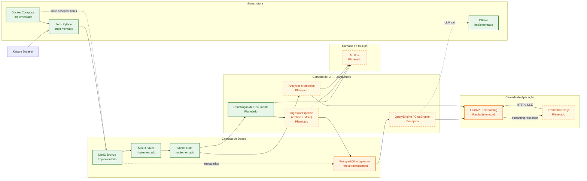
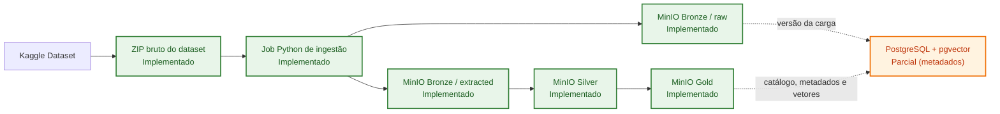
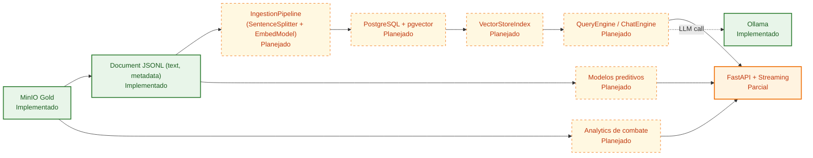
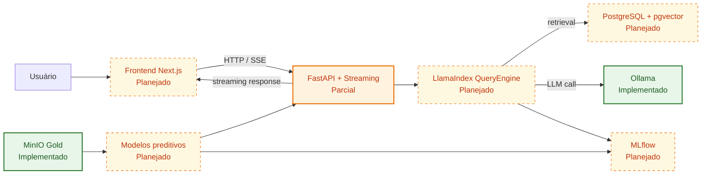

# RAG INTELLIGENCE

- Pedro Henrique Andrade Siqueira - 222471
- Enzo Cambraia - 223335
- Lucas Siqueira Gonçalves - 212138
- Tales Augusto Sartório Furlan - 212170
- João Vitor Wenceslau Campagnin - 222225
- José Antonio Classio Jr - 223663
- Thiago de Lima Santos- 223628
- Enzo Murat Aires de Alencar - 212189
- Luis Augusto Machado Oliveira - 223360
- Gustavo Sinto Botejara - 223257

# Product Backlog — CS:GO Analytics AI

## DataSet

[https://www.kaggle.com/datasets/skihikingkevin/csgo-matchmaking-damage](https://www.kaggle.com/datasets/skihikingkevin/csgo-matchmaking-damage)

## Arquitetura Geral

O sistema alvo do projeto é organizado em cinco camadas:

- **Dados**: ingestão do dataset externo, armazenamento em Data Lake e persistência de metadados e vetores.
- **IA**: preparação de features, geração de embeddings, recuperação semântica via LlamaIndex, analytics e modelos preditivos.
- **Aplicação**: API FastAPI com streaming (SSE/WebSocket) via LlamaIndex e frontend Next.js para visualização dos resultados.
- **MLOps**: rastreamento de experimentos, métricas e versionamento de modelos.
- **Infraestrutura**: execução local e orquestração dos serviços de dados e aplicação.

### Blocos Arquiteturais

- **Fonte externa**: Kaggle como origem do dataset `csgo-matchmaking-damage`.
- **Camada de Dados**: MinIO como Data Lake em estágios Bronze, Silver e Gold; PostgreSQL com extensão pgvector para metadados, versionamento e indexação vetorial. O PostgreSQL com pgvector é store relacional e vetorial, não broker de mensageria.
- **Camada de IA**: LlamaIndex como engine de RAG — `IngestionPipeline` para embeddings, `QueryEngine`/`ChatEngine` para recuperação e inferência, tudo dentro do processo FastAPI. Modelos preditivos com scikit-learn/pandas.
- **Camada de Aplicação**: FastAPI para endpoints HTTP e streaming (SSE/WebSocket) via `astream_chat()` do LlamaIndex; Next.js como cliente web.
- **Serviços de Suporte**: Ollama como provedor local de LLM/embeddings (fallback quando API keys não configuradas); provedores cloud (OpenAI, Anthropic, Voyage) via abstração LlamaIndex.
- **Camada de MLOps**: MLflow para registrar experimentos, métricas e versões de modelos.
- **Infraestrutura**: Docker Compose como orquestração local e jobs Python para ingestão e transformação de dados.

### Legenda

- `[Implementado]`: componente já existente no repositório ou validado localmente.
- `[Planejado]`: componente previsto no backlog, mas ainda não implementado.

### Visão Macro da Arquitetura



### Pipeline de Dados



### Pipeline de IA e RAG



### Fluxo de Aplicação e MLOps



### Estado Atual

- **Implementado**: PB01 (Bronze), PB02 (Silver), PB03 (Gold), PB04 (metadados e versionamento no PostgreSQL), PB05 (documents JSONL a partir da Gold), importer Python, transformers Silver/Gold/Documents, MinIO local, Docker Compose, CI (ruff + pyright + pytest).
- **Planejado**: PB06-PB08 (pipeline de IA/RAG), PB09-PB11 (API FastAPI + frontend Next.js), PB12-PB14 (ML/analytics), PB15-PB17 (MLOps/MLflow), PB18-PB20 (infra restante).

---

# Implementação PB05

## Objetivo

Transformar cada linha de `gold/<dataset_prefix>/<run_id>/curated/events.csv` em um document versionado com `doc_id`, `text` e `metadata`, persistindo os artefatos em JSONL particionado para uso posterior pela PB06/PB07.

## Pré-requisito

- Executar PB03 antes da PB05.
- Definir `GOLD_SOURCE_RUN_ID` com um run existente na Gold.

## Configuração

Variáveis da PB05:

- `GOLD_SOURCE_RUN_ID=` obrigatório
- `DOCUMENT_BUCKET=` opcional; se vazio usa `GOLD_BUCKET`
- `DOCUMENT_DATASET_PREFIX=` opcional; se vazio usa `GOLD_DATASET_PREFIX` e depois `SILVER_DATASET_PREFIX` / `BRONZE_DATASET_PREFIX`
- `DOCUMENT_RUN_ID=` opcional; se vazio usa `GOLD_SOURCE_RUN_ID`
- `DOCUMENT_PART_SIZE_ROWS=100000` opcional; controla quantas linhas vão em cada `part-xxxxx.jsonl`

## Saída

Os documents são gravados em:

- `gold/<dataset_prefix>/<run_id>/documents/part-00001.jsonl`
- `gold/<dataset_prefix>/<run_id>/documents/part-00002.jsonl`
- `gold/<dataset_prefix>/<run_id>/documents/manifest.json`
- `gold/<dataset_prefix>/<run_id>/documents/quality_report.json`

Cada linha do JSONL segue o contrato:

- `doc_id`: identificador estável no formato `<document_run_id>:<line_number>`
- `text`: texto em pt-BR com termos técnicos do jogo preservados
- `metadata`: objeto JSON flat com contexto do evento e linhagem do artefato

## Execução

Via Docker Compose:

```bash
docker compose run --rm document-builder
```

Via Makefile:

```bash
make documents
```

## Validação

Verifique no MinIO:

- parts JSONL em `gold/<dataset_prefix>/<run_id>/documents/`
- manifest em `gold/<dataset_prefix>/<run_id>/documents/manifest.json`
- relatório em `gold/<dataset_prefix>/<run_id>/documents/quality_report.json`

O pipeline lê o `events.csv` em streaming, gera um document por evento da Gold, tipa metadados numéricos/booleanos quando possível e registra a execução no catálogo `dataset_runs` com `stage=documents`.

# Implementação PB01

## Objetivo

Carregar o dataset `skihikingkevin/csgo-matchmaking-damage` do Kaggle para a camada Bronze em um MinIO local.

## O que é armazenado na Bronze

Cada execução gera um prefixo versionado em:

`bronze/csgo-matchmaking-damage/<run_id>/`

Conteúdo enviado:

- `raw/csgo-matchmaking-damage.zip`: artefato bruto baixado do Kaggle
- `extracted/*.csv`: arquivos tabulares extraídos do ZIP
- `extracted/*.png`: imagens de radar/mapa presentes no dataset

Esse formato preserva o artefato original e também deixa os arquivos úteis já acessíveis para as próximas etapas.

## Configuração

1. Copie `.env.example` para `.env`.
2. Preencha `KAGGLE_USERNAME` e `KAGGLE_KEY`, ou use um `kaggle.json` montado no container.

Variáveis principais:

- `MINIO_ENDPOINT=localhost:9000`
- `MINIO_ACCESS_KEY=minioadmin`
- `MINIO_SECRET_KEY=minioadmin`
- `MINIO_BUCKET=bronze`
- `MINIO_SECURE=false`
- `BRONZE_DATASET_SLUG=skihikingkevin/csgo-matchmaking-damage`
- `BRONZE_DATASET_PREFIX=csgo-matchmaking-damage`
- `BRONZE_RUN_ID=` opcional; se vazio, o sistema gera um timestamp UTC no formato `YYYYMMDDTHHMMSSZ`

## Execução com Docker Compose

Suba a stack base:

```bash
docker compose up -d
```

O `bronze-importer` fica em um profile manual, então `docker compose up` não executa a ingestão novamente.

Execute a importação:

```bash
docker compose run --rm bronze-importer
```

Se preferir usar `kaggle.json` em vez de variáveis de ambiente, monte o diretório da credencial no container. Exemplo em PowerShell:

```powershell
docker compose run --rm --volume "${env:USERPROFILE}\.kaggle:/root/.kaggle:ro" bronze-importer
```

## Execução local para debug

Instale as dependências e execute o módulo:

```bash
pip install -e .[dev]
python -m rag_intelligence
```

## Validação

Abra o console do MinIO em `http://localhost:9001` e confirme que o bucket `bronze` contém objetos em:

`csgo-matchmaking-damage/<run_id>/`

Os critérios mínimos de PB01 são atendidos quando o bucket Bronze contém o ZIP bruto e os arquivos extraídos `.csv`/`.png` da carga.

# Implementação PB02

## Objetivo

Limpar e padronizar os CSVs da Bronze para gerar a camada Silver versionada por run.

## Pré-requisito

- Executar PB01 antes da PB02.
- Definir `BRONZE_SOURCE_RUN_ID` com um run existente na Bronze.

## Configuração

Variáveis da PB02:

- `SILVER_BUCKET=silver`
- `SILVER_DATASET_PREFIX=` opcional; se vazio usa `BRONZE_DATASET_PREFIX`
- `BRONZE_SOURCE_RUN_ID=` obrigatório
- `SILVER_RUN_ID=` opcional; se vazio usa o valor de `BRONZE_SOURCE_RUN_ID`

## Execução

Via Docker Compose:

```bash
docker compose run --rm silver-transformer
```

Via Makefile:

```bash
make silver
```

## Validação

Verifique no MinIO:

- CSVs tratados em `silver/<dataset_prefix>/<run_id>/cleaned/`
- relatório de qualidade em `silver/<dataset_prefix>/<run_id>/quality_report.json`

As regras aplicadas incluem normalização de colunas, trim de texto, remoção de linhas totalmente nulas, remoção de duplicados e descarte de valores numéricos inválidos/negativos nas métricas conhecidas.

# Implementação PB03

## Objetivo

Consolidar os CSVs da Silver em um dataset Gold único com schema canônico para análise, mantendo compatibilidade com a v1 e adicionando contexto de evento.

Colunas base (compatíveis com a versão anterior):

`file, round, map, weapon, hp_dmg, arm_dmg, att_pos_x, att_pos_y, vic_pos_x, vic_pos_y`

Colunas extras:

`event_type, source_file, tick, seconds, start_seconds, end_seconds, att_team, vic_team, att_side, vic_side, wp_type, nade, hitbox, bomb_site, is_bomb_planted, att_id, vic_id, att_rank, vic_rank, winner_team, winner_side, round_type, ct_eq_val, t_eq_val, ct_alive, t_alive, nade_land_x, nade_land_y, avg_match_rank`

## Pré-requisito

- Executar PB02 antes da PB03.
- Definir `SILVER_SOURCE_RUN_ID` com um run existente na Silver.

## Configuração

Variáveis da PB03:

- `SILVER_SOURCE_RUN_ID=` obrigatório
- `GOLD_BUCKET=gold`
- `GOLD_DATASET_PREFIX=` opcional; se vazio usa `SILVER_DATASET_PREFIX` e depois `BRONZE_DATASET_PREFIX`
- `GOLD_RUN_ID=` opcional; se vazio usa `SILVER_SOURCE_RUN_ID`

## Execução

Via Docker Compose:

```bash
docker compose run --rm gold-transformer
```

Via Makefile:

```bash
make gold
```

## Validação

Verifique no MinIO:

- dataset consolidado em `gold/<dataset_prefix>/<run_id>/curated/events.csv`
- relatório de qualidade em `gold/<dataset_prefix>/<run_id>/quality_report.json`

O pipeline aplica `event_type` por tipo de arquivo, fallback de arma (`wp` -> `nade`), enriquecimento de mapa por (`file`, `round`), mantém posição da vítima opcional e valida como numéricas finitas as posições que estiverem preenchidas.

# Epic 1 — Preparação de Dados de Partidas

**Objetivo:** organizar e estruturar os dados de partidas de CS:GO.

| ID   | User Story                                                                                            | Camada                 | Critério de Aceite                        |
| ---- | ----------------------------------------------------------------------------------------------------- | ---------------------- | ----------------------------------------- |
| PB01 | Como desenvolvedor, quero importar o dataset de matchmaking do Kaggle para o Data Lake                | Dados (MinIO - Bronze) | Artefato bruto e arquivos extraídos armazenados no bucket bronze |
| PB02 | Como desenvolvedor, quero limpar e padronizar os dados de dano e combate                              | Dados (Silver)         | Dados sem valores inconsistentes          |
| PB03 | Como desenvolvedor, quero criar uma versão tratada com colunas relevantes (arma, dano, mapa, posição) | Dados (Gold)           | Dataset estruturado para análise          |
| PB04 | Como desenvolvedor, quero registrar metadados do dataset e versão no banco                            | Dados (PostgreSQL)     | Dataset versionado                        |

---

# Epic 2 — Pipeline de IA para Análise de Combate

**Objetivo:** construir o pipeline de RAG com LlamaIndex para análise semântica de eventos de combate.

| ID   | User Story                                                                              | Camada                   | Critério de Aceite                | Nota |
| ---- | --------------------------------------------------------------------------------------- | ------------------------ | --------------------------------- | ---- |
| PB05 | Como desenvolvedor, quero transformar eventos de combate em representações estruturadas | IA (Document construction) | Documents com texto e metadados gerados a partir do Gold | Lógica de negócio |
| PB06 | Como desenvolvedor, quero gerar embeddings de eventos de combate para busca semântica   | IA (LlamaIndex IngestionPipeline) | Embeddings criados e inseridos no pgvector | Configuração |
| PB07 | Como desenvolvedor, quero armazenar embeddings no banco vetorial                        | Dados (PostgreSQL + pgvector) | Vetores indexados no PostgreSQL com pgvector | Configuração (mesmo pipeline do PB06) |
| PB08 | Como usuário, quero buscar eventos similares de combate                                 | IA (LlamaIndex QueryEngine) | QueryEngine retorna eventos similares via API | Configuração |

---

# Epic 3 — API de Consulta de Dados

**Objetivo:** disponibilizar análise de partidas via API e frontend.

| ID   | User Story                                                                | Camada                | Critério de Aceite             |
| ---- | ------------------------------------------------------------------------- | --------------------- | ------------------------------ |
| PB09 | Como desenvolvedor, quero criar uma API para consultar eventos de combate | Aplicação (FastAPI + SSE/WebSocket) | Endpoints de chat/query com streaming via LlamaIndex `astream_chat()` |
| PB10 | Como usuário, quero pesquisar estatísticas de armas e dano                | Aplicação             | Dados retornados corretamente  |
| PB11 | Como usuário, quero visualizar análises do jogo                           | Aplicação (Next.js) | Resultados exibidos no frontend web            |

---

# Epic 4 — Análise Avançada com IA

**Objetivo:** aplicar modelos de machine learning para insights.

| ID   | User Story                                                                        | Camada                | Critério de Aceite     |
| ---- | --------------------------------------------------------------------------------- | --------------------- | ---------------------- |
| PB12 | Como desenvolvedor, quero treinar um modelo que preveja o resultado de um combate | IA (Machine Learning) | Modelo treinado        |
| PB13 | Como desenvolvedor, quero analisar padrões de uso de armas                        | IA (Analytics)        | Insights gerados       |
| PB14 | Como desenvolvedor, quero identificar hotspots de combate no mapa                 | IA (Spatial Analysis) | Mapas de calor gerados |

---

# Epic 5 — MLOps

**Objetivo:** monitorar experimentos e evolução do modelo.

| ID   | User Story                                                  | Camada         | Critério de Aceite       |
| ---- | ----------------------------------------------------------- | -------------- | ------------------------ |
| PB15 | Como desenvolvedor, quero registrar experimentos de modelos | MLOps (MLflow) | Experimentos registrados |
| PB16 | Como desenvolvedor, quero versionar modelos treinados       | MLOps          | Versões salvas           |
| PB17 | Como desenvolvedor, quero registrar métricas de desempenho  | MLOps          | Métricas armazenadas     |

---

# Epic 6 — Infraestrutura

| ID   | User Story                                                       | Camada                  | Critério de Aceite    |
| ---- | ---------------------------------------------------------------- | ----------------------- | --------------------- |
| PB18 | Como desenvolvedor, quero containerizar os serviços              | Infraestrutura (Docker) | API, frontend e serviços de dados containerizados |
| PB19 | Como desenvolvedor, quero orquestrar serviços com Docker Compose | Infraestrutura          | Stack local com todos os serviços executando |
| PB20 | Como desenvolvedor, quero documentar a arquitetura do sistema    | Infraestrutura          | README completo e alinhado ao fluxo assíncrono       |

---
