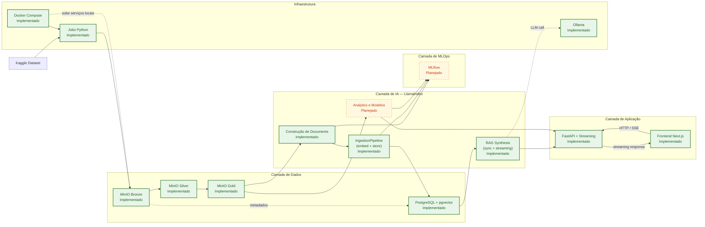
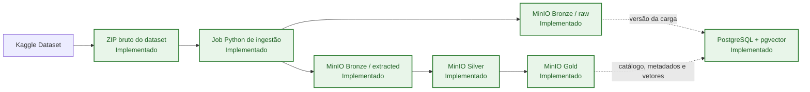
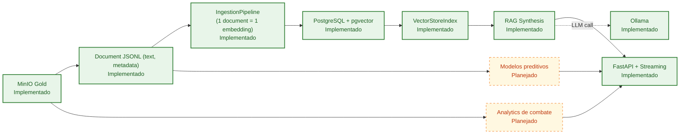
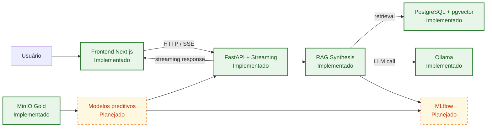

# RAG INTELLIGENCE

- Pedro Henrique Andrade Siqueira - 222471
- Enzo Cambraia - 223335
- Lucas Siqueira Gonçalves - 212138
- Tales Augusto Sartório Furlan - 212170
- João Vitor Wenceslau Campagnin - 222225
- José Antonio Classio Jr - 223663
- Thiago de Lima Santos- 223628
- Enzo Murat Aires de Alencar - 212189
- Luis Augusto Machado Oliveira - 223360
- Gustavo Sinto Botejara - 223257

# Product Backlog — CS:GO Analytics AI

## DataSet

[https://www.kaggle.com/datasets/skihikingkevin/csgo-matchmaking-damage](https://www.kaggle.com/datasets/skihikingkevin/csgo-matchmaking-damage)

## Arquitetura Geral

O sistema alvo do projeto é organizado em cinco camadas:

- **Dados**: ingestão do dataset externo, armazenamento em Data Lake e persistência de metadados e vetores.
- **IA**: preparação de features, geração de embeddings, recuperação semântica via LlamaIndex, analytics e modelos preditivos.
- **Aplicação**: API FastAPI com streaming (SSE/WebSocket) via LlamaIndex e frontend Next.js para visualização dos resultados.
- **MLOps**: rastreamento de experimentos, métricas e versionamento de modelos.
- **Infraestrutura**: execução local e orquestração dos serviços de dados e aplicação.

### Blocos Arquiteturais

- **Fonte externa**: Kaggle como origem do dataset `csgo-matchmaking-damage`.
- **Camada de Dados**: MinIO como Data Lake em estágios Bronze, Silver e Gold; PostgreSQL com extensão pgvector para metadados, versionamento e indexação vetorial. O PostgreSQL com pgvector é store relacional e vetorial, não broker de mensageria.
- **Camada de IA**: LlamaIndex como engine de RAG — `IngestionPipeline` para embeddings, `QueryEngine`/`ChatEngine` para recuperação e inferência, tudo dentro do processo FastAPI. Modelos preditivos com scikit-learn/pandas.
- **Camada de Aplicação**: FastAPI para endpoints HTTP e streaming (SSE/WebSocket) via `astream_chat()` do LlamaIndex; Next.js como cliente web.
- **Serviços de Suporte**: Ollama como provedor local de LLM/embeddings (fallback quando API keys não configuradas); provedores cloud (OpenAI, Anthropic, Voyage) via abstração LlamaIndex.
- **Camada de MLOps**: MLflow para registrar experimentos, métricas e versões de modelos.
- **Infraestrutura**: Docker Compose como orquestração local e jobs Python para ingestão e transformação de dados.

### Legenda

- `[Implementado]`: componente já existente no repositório ou validado localmente.
- `[Planejado]`: componente previsto no backlog, mas ainda não implementado.

### Visão Macro da Arquitetura



### Pipeline de Dados



### Pipeline de IA e RAG



### Fluxo de Aplicação e MLOps



### Estado Atual

- **Implementado**: PB01 (Bronze), PB02 (Silver), PB03 (Gold), PB04 (metadados e versionamento no PostgreSQL), PB05 (documents JSONL a partir da Gold), PB06 (ingestao de embeddings no pgvector), PB07 (hardening do storage vetorial com indices de metadata), PB08 (busca semantica local via CLI e endpoint `/search`), PB09 (API FastAPI com `/search` e `/rag/query` com streaming SSE), PB11 (frontend Next.js 16 com App Router, AI SDK, bootstrap server-side das sessoes e persistencia local em SQLite via route handlers), importer Python, transformers Silver/Gold/Documents/Embeddings, MinIO local, Docker Compose, CI (ruff + pyright + pytest + eslint + next build).
- **Planejado**: PB10 (stats de armas/dano), PB12-PB14 (ML/analytics), PB15-PB17 (MLOps/MLflow), PB18-PB20 (infra restante).

---

# Implementação PB05

## Objetivo

Transformar cada linha de `gold/<dataset_prefix>/<run_id>/curated/events.csv` em um document versionado com `doc_id`, `text` e `metadata`, persistindo os artefatos em JSONL particionado para uso posterior pela PB06/PB07.

## Pré-requisito

- Executar PB03 antes da PB05.
- Definir `GOLD_SOURCE_RUN_ID` com um run existente na Gold.

## Configuração

Variáveis da PB05:

- `GOLD_SOURCE_RUN_ID=` obrigatório
- `DOCUMENT_BUCKET=` opcional; se vazio usa `GOLD_BUCKET`
- `DOCUMENT_DATASET_PREFIX=` opcional; se vazio usa `GOLD_DATASET_PREFIX` e depois `SILVER_DATASET_PREFIX` / `BRONZE_DATASET_PREFIX`
- `DOCUMENT_RUN_ID=` opcional; se vazio usa `GOLD_SOURCE_RUN_ID`
- `DOCUMENT_PART_SIZE_ROWS=100000` opcional; controla quantas linhas vão em cada `part-xxxxx.jsonl`
- `DOCUMENT_MAX_ROWS=` opcional; limita quantas linhas da Gold serao convertidas em documents para smoke test

## Saída

Os documents são gravados em:

- `gold/<dataset_prefix>/<run_id>/documents/part-00001.jsonl`
- `gold/<dataset_prefix>/<run_id>/documents/part-00002.jsonl`
- `gold/<dataset_prefix>/<run_id>/documents/manifest.json`
- `gold/<dataset_prefix>/<run_id>/documents/quality_report.json`

Cada linha do JSONL segue o contrato:

- `doc_id`: identificador estável no formato `<document_run_id>:<line_number>`
- `text`: texto em pt-BR com termos técnicos do jogo preservados
- `metadata`: objeto JSON flat com contexto do evento e linhagem do artefato

## Execução

Via Docker Compose:

```bash
docker compose run --rm document-builder
```

Via Makefile:

```bash
make documents
```

## Validação

Verifique no MinIO:

- parts JSONL em `gold/<dataset_prefix>/<run_id>/documents/`
- manifest em `gold/<dataset_prefix>/<run_id>/documents/manifest.json`
- relatório em `gold/<dataset_prefix>/<run_id>/documents/quality_report.json`

Smoke rapido:

```bash
docker compose run --rm -e DOCUMENT_MAX_ROWS=25 -e DOCUMENT_RUN_ID=documents-smoke document-builder
make documents-smoke
```

O pipeline lê o `events.csv` em streaming, gera um document por evento da Gold, tipa metadados numéricos/booleanos quando possível e registra a execução no catálogo `dataset_runs` com `stage=documents`.

# Implementacao PB06

## Objetivo

Ler um run explicito da PB05 via `documents/manifest.json`, reconstruir `1 document = 1 node`, gerar embeddings com `DEFAULT_EMBED_MODEL` via `ProviderRegistry` e persistir tudo em uma unica tabela pgvector (`PG_TABLE_NAME`) com metadata completa e rastreavel por `embedding_run_id`.

## Pre-requisito

- Executar PB05 antes da PB06.
- Definir `DOCUMENT_SOURCE_RUN_ID` com um run existente da camada Documents.

## Configuracao

Variaveis da PB06:

- `DOCUMENT_SOURCE_RUN_ID=` obrigatorio
- `EMBEDDING_RUN_ID=` opcional; se vazio usa `DOCUMENT_SOURCE_RUN_ID`
- `DOCUMENT_BUCKET=` opcional; se vazio usa `GOLD_BUCKET`
- `DOCUMENT_DATASET_PREFIX=` opcional; se vazio usa `GOLD_DATASET_PREFIX` e depois `SILVER_DATASET_PREFIX` / `BRONZE_DATASET_PREFIX`
- `EMBEDDING_REPORT_BUCKET=` opcional; se vazio usa `DOCUMENT_BUCKET`
- `EMBEDDING_DATASET_PREFIX=` opcional; se vazio usa `DOCUMENT_DATASET_PREFIX`
- `EMBEDDING_BATCH_SIZE=256` opcional
- `EMBEDDING_NUM_WORKERS=4` opcional; controla o paralelismo interno do `pipeline.run(...)`
- `EMBEDDING_PARALLEL_BATCHES=4` opcional; controla quantos batches de embedding podem rodar em paralelo
- `OLLAMA_EMBED_BATCH_SIZE=32` opcional; controla o batch real enviado ao Ollama e costuma impactar mais o throughput do que aumentar apenas `EMBEDDING_BATCH_SIZE`
- `EMBEDDING_MAX_DOCUMENTS=` opcional; limita quantos documents do manifest serao indexados para smoke test
- `EMBEDDING_RESUME=false` opcional; quando `true`, continua do maior `node_id` ja persistido para o `embedding_run_id`, sem apagar o progresso existente
- `PG_TABLE_NAME=` nome da tabela vetorial unica
- `PG_EMBED_DIM=` dimensao esperada do vetor
- `DEFAULT_EMBED_MODEL=` modelo de embedding usado pelo pipeline

## Saida

Os artefatos operacionais da PB06 sao gravados em:

- `gold/<dataset_prefix>/<run_id>/embeddings/manifest.json`
- `gold/<dataset_prefix>/<run_id>/embeddings/quality_report.json`

Os vetores nao vao para o MinIO. Eles sao persistidos no PostgreSQL + pgvector na tabela unica configurada por `PG_TABLE_NAME`, com filtros por metadata JSONB.

## Execucao

Via Docker Compose:

```bash
docker compose run --rm embedding-ingestor
```

Via Makefile:

```bash
make embeddings
```

Smoke rapido:

```bash
docker compose run --rm -e DOCUMENT_SOURCE_RUN_ID=documents-smoke -e EMBEDDING_MAX_DOCUMENTS=25 -e EMBEDDING_RUN_ID=embeddings-smoke embedding-ingestor
make embeddings-smoke
```

Retomar um run parcial sem apagar:

```bash
docker compose run --rm -e DOCUMENT_SOURCE_RUN_ID=20260308T065422Z -e EMBEDDING_RUN_ID=20260308T092115Z -e EMBEDDING_RESUME=true embedding-ingestor
```

Para maquina local com Ollama em CPU, a configuracao recomendada hoje e:

- `EMBEDDING_BATCH_SIZE=128` ou `256`
- `EMBEDDING_NUM_WORKERS=4`
- `EMBEDDING_PARALLEL_BATCHES=4`
- `OLLAMA_EMBED_BATCH_SIZE=128` ou `256`

Subir so `EMBEDDING_BATCH_SIZE` sem ajustar `OLLAMA_EMBED_BATCH_SIZE` tende a ajudar pouco, porque o adapter do Ollama continua fatiando os textos internamente. Para aproveitar mais CPU, a PB06 agora tambem consegue processar batches de embedding em paralelo e serializar apenas a escrita no pgvector.

## Validacao

Verifique no MinIO:

- manifest em `gold/<dataset_prefix>/<run_id>/embeddings/manifest.json`
- relatorio em `gold/<dataset_prefix>/<run_id>/embeddings/quality_report.json`

Verifique no PostgreSQL:

- linhas na tabela vetorial com `metadata.embedding_run_id = <run_id>`
- metadata preservando `doc_id`, `event_type`, `map`, `file`, `round` e `source_file`

Por padrao, o pipeline faz delete + reinsert por `embedding_run_id`. Quando `EMBEDDING_RESUME=true`, ele consulta o progresso ja persistido, valida se o run existente esta contiguo desde o document `1` e continua dali sem apagar. A execucao segue registrando metadata em `dataset_runs` no fim do job. A PB07 endurece esse mesmo caminho com contrato explicito da tabela vetorial e indices BTREE para filtros de metadata.

# Implementacao PB07

## Objetivo

Endurecer o armazenamento vetorial da PB06 sem criar pipeline novo, garantindo contrato estavel para a tabela unica `public.data_<PG_TABLE_NAME>` e indices oficiais para os filtros que a PB08 vai usar.

## O que foi endurecido

- a tabela vetorial continua unica e versionada por metadata, sem tabela por run
- o indice HNSW de `embedding` foi preservado
- o pipeline passou a garantir os seguintes indices BTREE:
  - `metadata_->>'embedding_run_id'`
  - `metadata_->>'event_type'`
  - `metadata_->>'map'`
  - `metadata_->>'file'`
  - `((metadata_->>'round')::integer)` com filtro parcial seguro
- o bootstrap do storage roda dentro do `embedding-ingest`, depois da inicializacao do `PGVectorStore` e antes do `delete + reinsert`
- tabelas antigas da PB06 sao corrigidas in-place com `CREATE INDEX IF NOT EXISTS`, sem recriar tabela e sem apagar vetores

## Contrato da tabela vetorial

- tabela fisica: `public.data_<PG_TABLE_NAME>`
- politica de reprocessamento: `delete + reinsert` por `embedding_run_id`, com resume opcional quando `EMBEDDING_RESUME=true`
- filtros oficialmente suportados/otimizados:
  - `embedding_run_id`
  - `event_type`
  - `map`
  - `file`
  - `round`

## Observabilidade

Os artefatos operacionais da PB06/PB07 agora registram tambem:

- `pg_data_table_name`
- `ensured_indexes`

Esses campos aparecem em:

- `gold/<dataset_prefix>/<run_id>/embeddings/manifest.json`
- `gold/<dataset_prefix>/<run_id>/embeddings/quality_report.json`

## Validacao

Depois de rodar `docker compose run --rm --build embedding-ingestor`, valide no PostgreSQL:

```sql
SELECT indexname
FROM pg_indexes
WHERE schemaname = 'public'
  AND tablename = 'data_rag_embeddings';
```

E confira a presenca dos indices:

- `data_rag_embeddings_meta_embedding_run_id_idx`
- `data_rag_embeddings_meta_event_type_idx`
- `data_rag_embeddings_meta_map_idx`
- `data_rag_embeddings_meta_file_idx`
- `data_rag_embeddings_meta_round_int_idx`

# Implementacao PB08

## Objetivo

Validar o RAG localmente com busca semantica sobre a tabela vetorial existente, sem criar endpoint HTTP ainda e sem sintetizar resposta com LLM.

## Interface

Novo comando local:

```bash
semantic-search --query "dano de ak47 no inferno" --embedding-run-id embeddings-smoke --top-k 3
```

Via Docker Compose:

```bash
docker compose run --rm semantic-searcher --query "dano de ak47 no inferno" --embedding-run-id embeddings-smoke --top-k 3
```

Via Makefile:

```bash
make search QUERY="dano de ak47 no inferno" EMBEDDING_RUN_ID="embeddings-smoke"
```

Filtros opcionais suportados:

- `--event-type`
- `--map`
- `--file`
- `--round`

## Saida

A resposta sai em JSON no stdout com:

- `query`
- `embedding_run_id`
- `top_k`
- `filters`
- `results_returned`
- `retrieval_ms`
- `results`

Cada item de `results` inclui `rank`, `score`, `doc_id`, `text`, `event_type`, `map`, `file`, `round`, `source_file` e `metadata` sanitizada.

## Comportamento

- o `embedding_run_id` e obrigatorio e sempre entra como filtro
- a busca usa o `ProviderRegistry` para embeddar a query
- o retrieval consulta apenas `public.data_<PG_TABLE_NAME>`
- a metadata da resposta remove chaves internas do LlamaIndex que comecam com `_`
- resultado vazio nao e erro; retorna `results: []`

## Validacao

Smoke recomendado:

```bash
make documents-smoke
make embeddings-smoke
make search QUERY="dano de ak47 no inferno" EMBEDDING_RUN_ID="embeddings-smoke"
```

Se quiser um smoke mais representativo sem ir para a base toda, rode com override:

```bash
DOCUMENT_MAX_ROWS=100 make documents-smoke
DOCUMENT_SOURCE_RUN_ID=documents-smoke EMBEDDING_MAX_DOCUMENTS=100 OLLAMA_EMBED_BATCH_SIZE=32 make embeddings-smoke
make search QUERY="dano de ak47" EMBEDDING_RUN_ID="embeddings-smoke"
```

A PB08 entrega retrieval local reutilizavel para a PB09, que depois expora essa mesma logica via FastAPI.

# Implementacao PB09

## Objetivo

Expor a busca semantica (PB08) e a sintese RAG via API FastAPI com suporte a streaming SSE.

## Endpoints

### POST /search

Busca semantica sobre a tabela vetorial. Aceita os mesmos filtros da PB08.

Body:

- `query` (string, obrigatorio)
- `embedding_run_id` (string, obrigatorio — ou usa `DEFAULT_EMBEDDING_RUN_ID`)
- `top_k` (int, opcional, default 5)
- `event_type`, `map`, `file`, `round` (opcionais)

Retorna JSON com `query`, `embedding_run_id`, `top_k`, `filters`, `results_returned`, `retrieval_ms` e `results`.

### POST /rag/query

Sintese RAG: recupera documentos relevantes e gera resposta com LLM.

Body:

- `query` (string, obrigatorio)
- `embedding_run_id` (string, obrigatorio — ou usa `DEFAULT_EMBEDDING_RUN_ID`)
- `top_k` (int, opcional, default 5)
- `stream` (bool, opcional, default false)
- `event_type`, `map`, `file`, `round` (opcionais)

Modo sync: retorna JSON com `answer`, `sources`, `retrieval_ms` e `generation_ms`.

Modo streaming (`stream: true`): retorna `text/event-stream` com eventos SSE:

- `event: sources` — lista de documentos recuperados
- `event: token` — tokens incrementais da resposta
- `event: done` — sinaliza fim com metricas

## Execucao

Via Makefile:

```bash
make api
```

Via Docker Compose:

```bash
docker compose up -d rag-api
```

# Implementacao PB11

## Objetivo

Frontend Next.js para interação com o RAG via chat, com streaming de respostas, histórico local de sessões e integração com Ollama + busca semântica do backend.

## Stack

- Next.js 16 com App Router e React 19
- AI SDK (`ai` + `@ai-sdk/react`) para streaming e estado do chat
- SQLite (`better-sqlite3`) para persistência local de sessões e mensagens
- Route Handlers do Next.js para `chat` e CRUD de sessões
- `ollama-ai-provider-v2` para comunicação com modelos locais
- shadcn/ui + Tailwind CSS v4 para interface
- `react-grab` carregado apenas em desenvolvimento para debug visual da UI

## Arquitetura atual

- `frontend/src/app/page.tsx` é um Server Component dinâmico que faz o bootstrap inicial da sessão ativa e das mensagens já persistidas.
- `frontend/src/components/chat/chat-app.tsx` é a ilha cliente principal. Ela usa `useChat` como fonte de verdade do chat ativo e mantém apenas um cache local por sessão para navegação.
- `frontend/src/app/api/chat/route.ts` recebe os requests do AI SDK, persiste a mensagem do usuário, executa `streamText(...)` com Ollama e salva a resposta final do assistente.
- `frontend/src/app/api/sessions/*` expõe listagem, criação, renomeação, remoção e carregamento de mensagens das sessões.
- `frontend/src/lib/chat-session-store.ts` concentra a leitura e escrita no SQLite.
- `frontend/src/lib/db.ts` cria `frontend/data/chat.db` e garante o schema das tabelas `sessions` e `messages`.
- `frontend/src/app/dev-tools.tsx` carrega `react-grab` somente em `development`.

## Fluxo do chat

1. O servidor renderiza a página com a sessão mais recente e as mensagens iniciais.
2. O cliente envia novas mensagens com `useChat`.
3. O route handler `/api/chat` usa um tool de busca para consultar `POST {RAG_API_URL}/search` quando o modo RAG está ativo.
4. O modelo local é chamado via Ollama e a resposta é streamada para a UI.
5. Sessões e mensagens ficam persistidas no SQLite local do frontend.

## Variáveis principais

- `RAG_API_URL` — URL base da API FastAPI usada pela ferramenta de busca. Default: `http://localhost:8000`
- `EMBEDDING_RUN_ID` — run de embeddings consultado pela busca semântica
- `OLLAMA_BASE_URL` — URL base do Ollama. Default: `http://localhost:11434`
- `OLLAMA_MODEL` — modelo default usado pelo chat quando o usuário não seleciona outro

## Estrutura de pastas

- `frontend/src/app/page.tsx` — bootstrap server-side da UI
- `frontend/src/components/chat/chat-app.tsx` — estado cliente do chat
- `frontend/src/app/api/chat/route.ts` — streaming AI SDK + persistência da resposta
- `frontend/src/app/api/sessions/` — CRUD das sessões
- `frontend/src/lib/chat-session-store.ts` — acesso ao SQLite
- `frontend/src/lib/chat-models.ts` — catálogo de modelos e modos RAG
- `frontend/src/components/ai-elements/` — componentes de chat baseados em vendor code
- `frontend/src/components/ui/` — componentes de interface reutilizáveis

## Execução

Dev server:

```bash
make frontend
```

Build de produção:

```bash
make frontend-build
```

Reset do banco de chat:

```bash
make db-reset
```

CI local do frontend:

```bash
make ci-frontend
```

# Implementação PB01

## Objetivo

Carregar o dataset `skihikingkevin/csgo-matchmaking-damage` do Kaggle para a camada Bronze em um MinIO local.

## O que é armazenado na Bronze

Cada execução gera um prefixo versionado em:

`bronze/csgo-matchmaking-damage/<run_id>/`

Conteúdo enviado:

- `raw/csgo-matchmaking-damage.zip`: artefato bruto baixado do Kaggle
- `extracted/*.csv`: arquivos tabulares extraídos do ZIP
- `extracted/*.png`: imagens de radar/mapa presentes no dataset

Esse formato preserva o artefato original e também deixa os arquivos úteis já acessíveis para as próximas etapas.

## Configuração

1. Copie `.env.example` para `.env`.
2. Preencha `KAGGLE_USERNAME` e `KAGGLE_KEY`, ou use um `kaggle.json` montado no container.

Variáveis principais:

- `MINIO_ENDPOINT=localhost:9000`
- `MINIO_ACCESS_KEY=minioadmin`
- `MINIO_SECRET_KEY=minioadmin`
- `MINIO_BUCKET=bronze`
- `MINIO_SECURE=false`
- `BRONZE_DATASET_SLUG=skihikingkevin/csgo-matchmaking-damage`
- `BRONZE_DATASET_PREFIX=csgo-matchmaking-damage`
- `BRONZE_RUN_ID=` opcional; se vazio, o sistema gera um timestamp UTC no formato `YYYYMMDDTHHMMSSZ`

## Execução com Docker Compose

Suba a stack base:

```bash
docker compose up -d
```

O `bronze-importer` fica em um profile manual, então `docker compose up` não executa a ingestão novamente.

Execute a importação:

```bash
docker compose run --rm bronze-importer
```

Se preferir usar `kaggle.json` em vez de variáveis de ambiente, monte o diretório da credencial no container. Exemplo em PowerShell:

```powershell
docker compose run --rm --volume "${env:USERPROFILE}\.kaggle:/root/.kaggle:ro" bronze-importer
```

## Execução local para debug

Instale as dependências e execute o módulo:

```bash
pip install -e .[dev]
python -m rag_intelligence
```

## Validação

Abra o console do MinIO em `http://localhost:9001` e confirme que o bucket `bronze` contém objetos em:

`csgo-matchmaking-damage/<run_id>/`

Os critérios mínimos de PB01 são atendidos quando o bucket Bronze contém o ZIP bruto e os arquivos extraídos `.csv`/`.png` da carga.

# Implementação PB02

## Objetivo

Limpar e padronizar os CSVs da Bronze para gerar a camada Silver versionada por run.

## Pré-requisito

- Executar PB01 antes da PB02.
- Definir `BRONZE_SOURCE_RUN_ID` com um run existente na Bronze.

## Configuração

Variáveis da PB02:

- `SILVER_BUCKET=silver`
- `SILVER_DATASET_PREFIX=` opcional; se vazio usa `BRONZE_DATASET_PREFIX`
- `BRONZE_SOURCE_RUN_ID=` obrigatório
- `SILVER_RUN_ID=` opcional; se vazio usa o valor de `BRONZE_SOURCE_RUN_ID`

## Execução

Via Docker Compose:

```bash
docker compose run --rm silver-transformer
```

Via Makefile:

```bash
make silver
```

## Validação

Verifique no MinIO:

- CSVs tratados em `silver/<dataset_prefix>/<run_id>/cleaned/`
- relatório de qualidade em `silver/<dataset_prefix>/<run_id>/quality_report.json`

As regras aplicadas incluem normalização de colunas, trim de texto, remoção de linhas totalmente nulas, remoção de duplicados e descarte de valores numéricos inválidos/negativos nas métricas conhecidas.

# Implementação PB03

## Objetivo

Consolidar os CSVs da Silver em um dataset Gold único com schema canônico para análise, mantendo compatibilidade com a v1 e adicionando contexto de evento.

Colunas base (compatíveis com a versão anterior):

`file, round, map, weapon, hp_dmg, arm_dmg, att_pos_x, att_pos_y, vic_pos_x, vic_pos_y`

Colunas extras:

`event_type, source_file, tick, seconds, start_seconds, end_seconds, att_team, vic_team, att_side, vic_side, wp_type, nade, hitbox, bomb_site, is_bomb_planted, att_id, vic_id, att_rank, vic_rank, winner_team, winner_side, round_type, ct_eq_val, t_eq_val, ct_alive, t_alive, nade_land_x, nade_land_y, avg_match_rank`

## Pré-requisito

- Executar PB02 antes da PB03.
- Definir `SILVER_SOURCE_RUN_ID` com um run existente na Silver.

## Configuração

Variáveis da PB03:

- `SILVER_SOURCE_RUN_ID=` obrigatório
- `GOLD_BUCKET=gold`
- `GOLD_DATASET_PREFIX=` opcional; se vazio usa `SILVER_DATASET_PREFIX` e depois `BRONZE_DATASET_PREFIX`
- `GOLD_RUN_ID=` opcional; se vazio usa `SILVER_SOURCE_RUN_ID`

## Execução

Via Docker Compose:

```bash
docker compose run --rm gold-transformer
```

Via Makefile:

```bash
make gold
```

## Validação

Verifique no MinIO:

- dataset consolidado em `gold/<dataset_prefix>/<run_id>/curated/events.csv`
- relatório de qualidade em `gold/<dataset_prefix>/<run_id>/quality_report.json`

O pipeline aplica `event_type` por tipo de arquivo, fallback de arma (`wp` -> `nade`), enriquecimento de mapa por (`file`, `round`), mantém posição da vítima opcional e valida como numéricas finitas as posições que estiverem preenchidas.

# Epic 1 — Preparação de Dados de Partidas

**Objetivo:** organizar e estruturar os dados de partidas de CS:GO.

| ID   | User Story                                                                                            | Camada                 | Critério de Aceite                        |
| ---- | ----------------------------------------------------------------------------------------------------- | ---------------------- | ----------------------------------------- |
| PB01 | Como desenvolvedor, quero importar o dataset de matchmaking do Kaggle para o Data Lake                | Dados (MinIO - Bronze) | Artefato bruto e arquivos extraídos armazenados no bucket bronze |
| PB02 | Como desenvolvedor, quero limpar e padronizar os dados de dano e combate                              | Dados (Silver)         | Dados sem valores inconsistentes          |
| PB03 | Como desenvolvedor, quero criar uma versão tratada com colunas relevantes (arma, dano, mapa, posição) | Dados (Gold)           | Dataset estruturado para análise          |
| PB04 | Como desenvolvedor, quero registrar metadados do dataset e versão no banco                            | Dados (PostgreSQL)     | Dataset versionado                        |

---

# Epic 2 — Pipeline de IA para Análise de Combate

**Objetivo:** construir o pipeline de RAG com LlamaIndex para análise semântica de eventos de combate.

| ID   | User Story                                                                              | Camada                   | Critério de Aceite                | Nota |
| ---- | --------------------------------------------------------------------------------------- | ------------------------ | --------------------------------- | ---- |
| PB05 | Como desenvolvedor, quero transformar eventos de combate em representações estruturadas | IA (Document construction) | Documents com texto e metadados gerados a partir do Gold | Lógica de negócio |
| PB06 | Como desenvolvedor, quero gerar embeddings de eventos de combate para busca semântica   | IA (LlamaIndex IngestionPipeline) | Embeddings criados e inseridos no pgvector | Configuração |
| PB07 | Como desenvolvedor, quero armazenar embeddings no banco vetorial                        | Dados (PostgreSQL + pgvector) | Vetores indexados no PostgreSQL com pgvector e filtros de metadata otimizados | Hardening do storage vetorial |
| PB08 | Como usuário, quero buscar eventos similares de combate                                 | IA (Retrieval local sobre pgvector) | CLI retorna eventos similares com score e metadata filtrável | Retrieval local |

---

# Epic 3 — API de Consulta de Dados

**Objetivo:** disponibilizar análise de partidas via API e frontend.

| ID   | User Story                                                                | Camada                | Critério de Aceite             |
| ---- | ------------------------------------------------------------------------- | --------------------- | ------------------------------ |
| PB09 | Como desenvolvedor, quero criar uma API para consultar eventos de combate | Aplicação (FastAPI + SSE/WebSocket) | Endpoints de chat/query com streaming via LlamaIndex `astream_chat()` |
| PB10 | Como usuário, quero pesquisar estatísticas de armas e dano                | Aplicação             | Dados retornados corretamente  |
| PB11 | Como usuário, quero visualizar análises do jogo                           | Aplicação (Next.js) | Resultados exibidos no frontend web            |

---

# Epic 4 — Análise Avançada com IA

**Objetivo:** aplicar modelos de machine learning para insights.

| ID   | User Story                                                                        | Camada                | Critério de Aceite     |
| ---- | --------------------------------------------------------------------------------- | --------------------- | ---------------------- |
| PB12 | Como desenvolvedor, quero treinar um modelo que preveja o resultado de um combate | IA (Machine Learning) | Modelo treinado        |
| PB13 | Como desenvolvedor, quero analisar padrões de uso de armas                        | IA (Analytics)        | Insights gerados       |
| PB14 | Como desenvolvedor, quero identificar hotspots de combate no mapa                 | IA (Spatial Analysis) | Mapas de calor gerados |

---

# Epic 5 — MLOps

**Objetivo:** monitorar experimentos e evolução do modelo.

| ID   | User Story                                                  | Camada         | Critério de Aceite       |
| ---- | ----------------------------------------------------------- | -------------- | ------------------------ |
| PB15 | Como desenvolvedor, quero registrar experimentos de modelos | MLOps (MLflow) | Experimentos registrados |
| PB16 | Como desenvolvedor, quero versionar modelos treinados       | MLOps          | Versões salvas           |
| PB17 | Como desenvolvedor, quero registrar métricas de desempenho  | MLOps          | Métricas armazenadas     |

---

# Epic 6 — Infraestrutura

| ID   | User Story                                                       | Camada                  | Critério de Aceite    |
| ---- | ---------------------------------------------------------------- | ----------------------- | --------------------- |
| PB18 | Como desenvolvedor, quero containerizar os serviços              | Infraestrutura (Docker) | API, frontend e serviços de dados containerizados |
| PB19 | Como desenvolvedor, quero orquestrar serviços com Docker Compose | Infraestrutura          | Stack local com todos os serviços executando |
| PB20 | Como desenvolvedor, quero documentar a arquitetura do sistema    | Infraestrutura          | README completo e alinhado ao fluxo assíncrono       |

---
