# Backend Architecture — `src/rag_intelligence`

Mapa de arquitetura do backend Python: endpoints HTTP, CLIs batch, módulos internos e integrações externas.  
Entry point da API: `rag_intelligence.api.main:app` (porta padrão **8000**).

---

## 1. Visão geral — camadas e pacotes

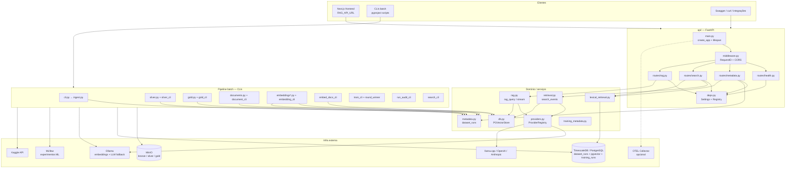

---

## 2. Superfície HTTP — endpoints por use case

| Use case | Método | Path | Handler | Módulo de domínio |
|----------|--------|------|---------|-------------------|
| **Ops / health** | `GET` | `/health` | `health()` | — |
| **Governança** | `GET` | `/metadata` | `metadata()` | `metadata.py` |
| **Governança ML** | `GET` | `/metadata/training` | `training_metadata()` | `lexical_retrieval.py` |
| **Busca vetorial** | `POST` | `/search` | `search()` | `retrieval.py` |
| **Busca híbrida** | `POST` | `/search/hybrid` | `hybrid_search()` | `retrieval.py` + `lexical_retrieval.py` |
| **RAG server-side** | `POST` | `/rag/query` | `query()` | `rag.py` |
| **RAG server-side (alias)** | `POST` | `/query` | `query()` | `rag.py` |

Documentação interativa: `http://localhost:8000/docs`

---

## 3. Bootstrap da aplicação (todas as requisições)

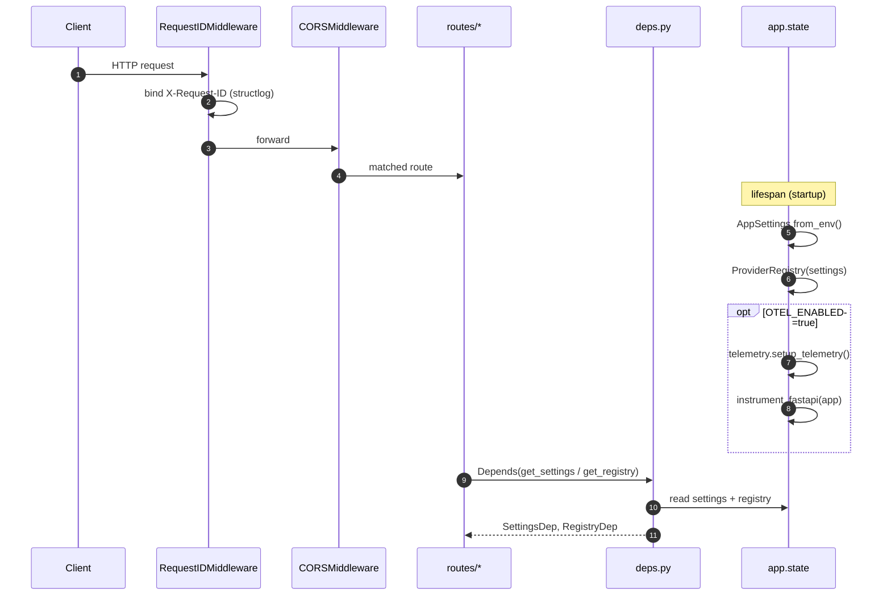

**Arquivos:** `api/main.py`, `api/middleware.py`, `api/deps.py`, `settings.py`, `telemetry.py`

---

## 4. Use case — Ops & health check

**Objetivo:** verificar se o processo FastAPI está vivo (load balancer, Docker, CI).

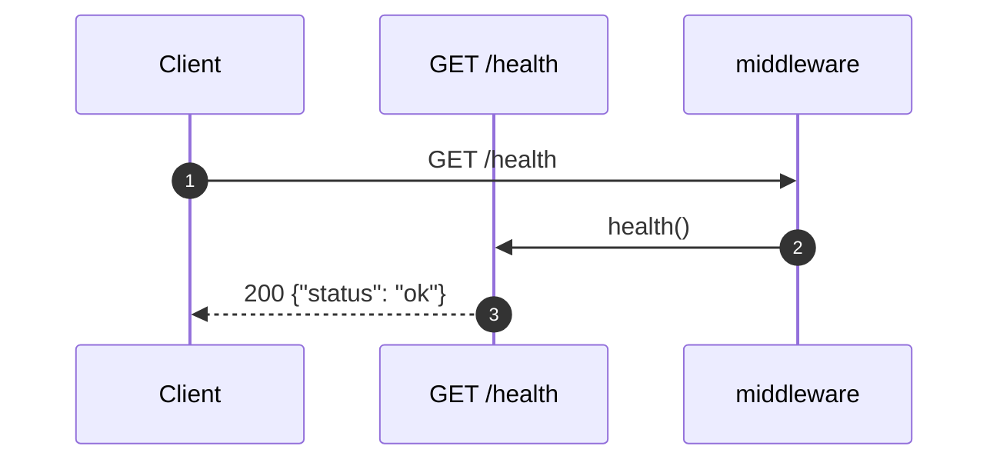

| Campo | Valor |
|-------|-------|
| Path | `GET /health` |
| Auth | nenhuma |
| Dependências externas | nenhuma |

---

## 5. Use case — Governança de dados & lineage

**Objetivo:** consultar catálogo `dataset_runs`, metadados de serviço e último treinamento ML.

### 5.1 `GET /metadata` — modos de consulta

| Query params | Comportamento |
|--------------|---------------|
| _(vazio)_ | Metadados do serviço (stages, tabela vetorial, modelos default) |
| `stage=bronze\|silver\|gold\|documents\|embeddings` | Último run da stage |
| `stage` + `run_id` | Run específico |
| `stage` + `run_id` + `lineage=true` | Cadeia upstream completa |

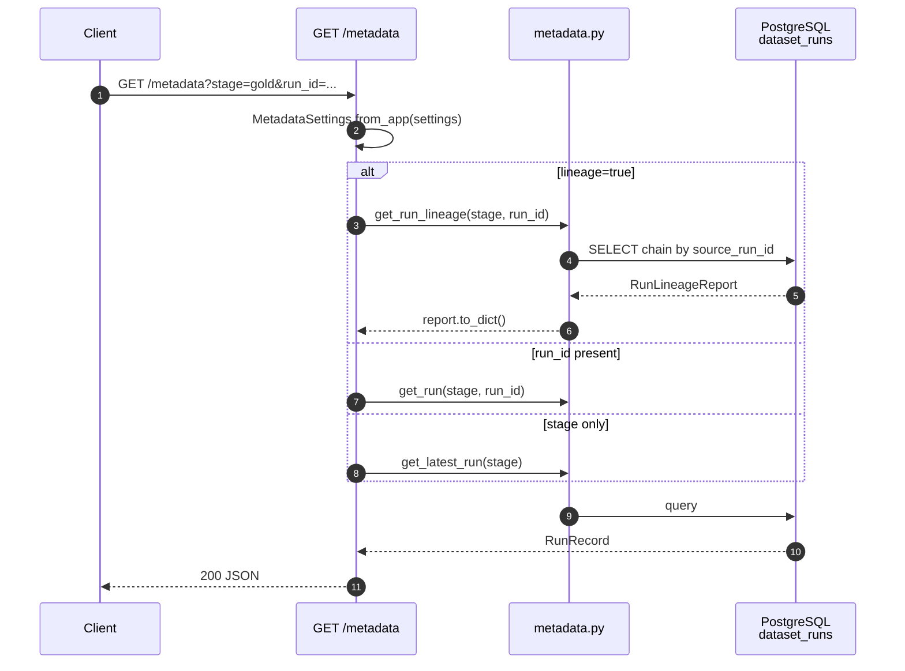

### 5.2 `GET /metadata/training`

**Objetivo:** expor o último run de treinamento para tools do chat e demos.

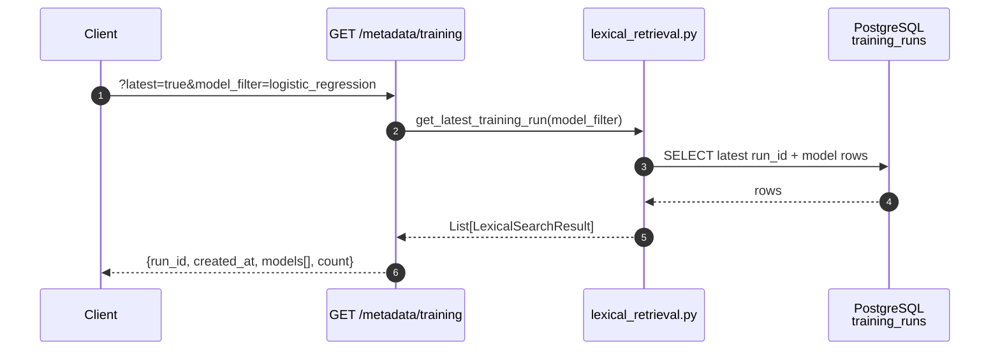

**CLI equivalente (sem HTTP):** `run-audit --stage embeddings --run-id <id>` → `metadata.get_run_lineage()`

**Arquivos:** `api/routes/metadata.py`, `metadata.py`, `lexical_retrieval.py`, `run_audit_cli.py`

---

## 6. Use case — Busca semântica (vetorial)

**Objetivo:** recuperar chunks/documentos por similaridade coseno no pgvector, **sem** síntese LLM.

**Endpoint:** `POST /search`

### Request body (principais campos)

| Campo | Obrigatório | Descrição |
|-------|-------------|-----------|
| `query` | sim | Texto da busca |
| `embedding_run_id` | sim* | Run de embeddings (* ou `DEFAULT_EMBEDDING_RUN_ID`) |
| `top_k` | não (5) | Quantidade de resultados |
| `event_type`, `map_name`, `file_name`, `round_number` | não | Filtros metadata CS:GO |
| `pipeline_phase` | não | Filtro docs do pipeline (`bronze`, `silver`, …) |

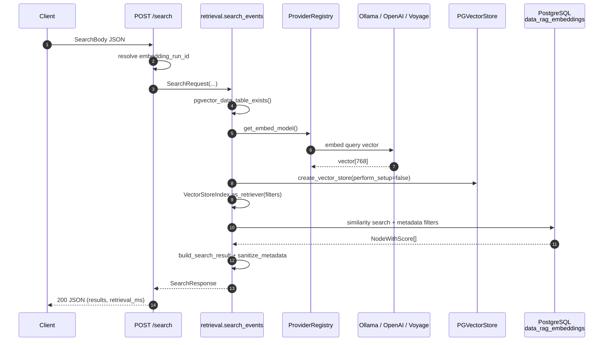

**CLI equivalente:** `semantic-search --query "..." --embedding-run-id pipeline-docs`

**Arquivos:** `api/routes/search.py`, `retrieval.py`, `providers.py`, `db.py`, `search_cli.py`

---

## 7. Use case — Busca híbrida (docs + métricas ML)

**Objetivo:** combinar busca semântica (documentação / eventos embeddados) com busca lexical FTS em `training_runs`.  
**Principal integração do frontend** via tools do chat.

**Endpoint:** `POST /search/hybrid`

| Flag | Efeito |
|------|--------|
| `include_semantic=true` | Chama `search_events()` com `document_tier=pipeline_doc` |
| `include_lexical=true` | Chama `lexical_search()` em `training_runs` |
| `pipeline_phase` | Filtro semântico por fase do pipeline |
| `model_filter` | Filtro lexical por `model_name` |

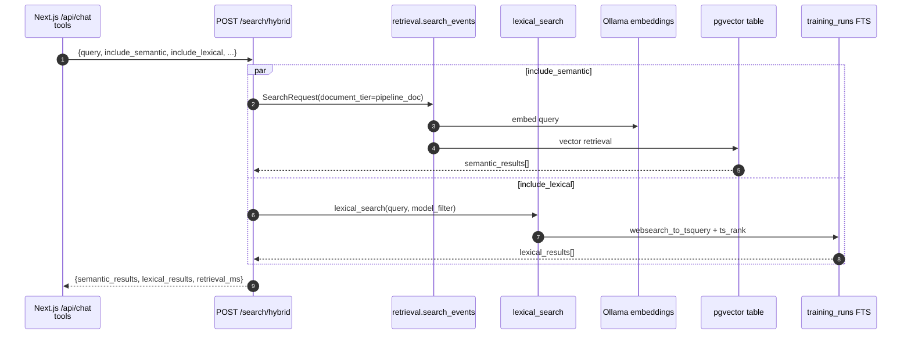

### Integração frontend → backend (tools)

```mermaid
flowchart LR
    subgraph next [frontend/src/app/api/chat/route.ts]
        T1[searchPipelineDocs]
        T2[searchTrainingMetrics]
        T3[getLatestTrainingRun]
    end

    T1 -->|POST /search/hybrid<br/>semantic only| HYB[/search/hybrid]
    T2 -->|POST /search/hybrid<br/>lexical only| HYB
    T3 -->|GET /metadata/training| TRN[/metadata/training]

    HYB --> API[FastAPI rag-api :8000]
    TRN --> API
```

**Arquivos:** `api/routes/search.py`, `retrieval.py`, `lexical_retrieval.py`, `training_metadata.py`

---

## 8. Use case — RAG server-side (retrieval + LLM)

**Objetivo:** endpoint alternativo que faz retrieval **e** gera resposta com LlamaIndex QueryEngine no backend.  
O chat principal do frontend usa AI SDK + tools (`/search/hybrid`); este endpoint é útil para integrações diretas e Swagger.

**Endpoints:** `POST /rag/query` e `POST /query` (mesmo handler)

| Campo | Descrição |
|-------|-----------|
| `stream=false` | JSON sync: `{answer, sources, retrieval_ms, generation_ms}` |
| `stream=true` | SSE: `sources` → `chunk`* → `done` |
| `llm_key` | Override LLM (`llama-cpp/gemma4`, `ollama/...`, `gpt-4o`, …) |

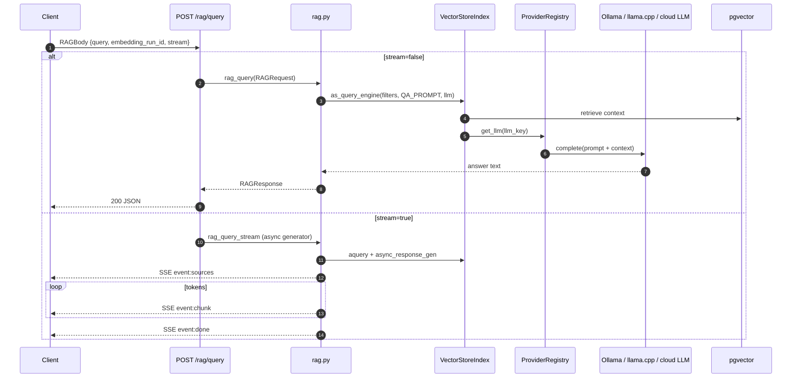

**Arquivos:** `api/routes/rag.py`, `rag.py`, `retrieval.py`, `providers.py`, `db.py`

---

## 9. Use case — Pipeline batch (CLIs, sem HTTP)

Jobs executados via Docker Compose profile `jobs` ou scripts `pyproject.toml`.  
Cada stage registra lineage em `dataset_runs`.

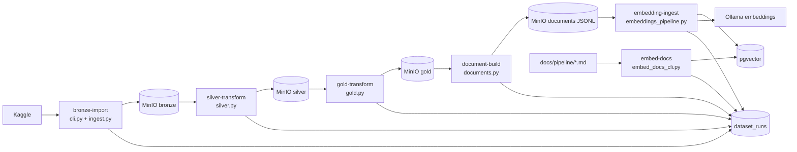

### Sequência — ingestão Bronze

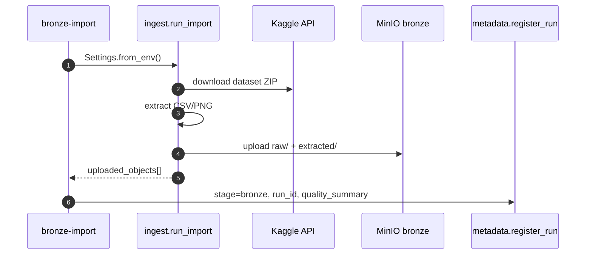

### Sequência — embedding ingest (eventos CS:GO)

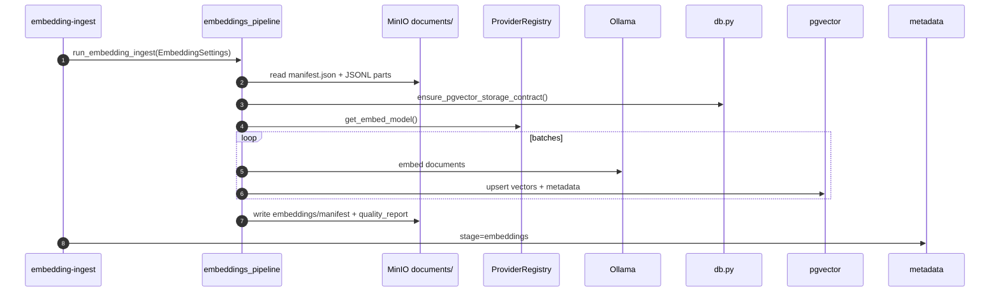

| Script CLI | Entry point | Módulo principal | Saída |
|------------|-------------|------------------|-------|
| `bronze-import` | `cli.py` | `ingest.py` | MinIO `bronze/...` |
| `silver-transform` | `silver_cli.py` | `silver.py` | MinIO `silver/.../round_meta_context.csv` |
| `gold-transform` | `gold_cli.py` | `gold.py` | MinIO `gold/.../round_context.csv` |
| `document-build` | `document_cli.py` | `documents.py` | MinIO `.../documents/*.jsonl` |
| `embedding-ingest` | `embedding_cli.py` | `embeddings_pipeline.py` | pgvector + MinIO reports |
| `embed-docs` | `embed_docs_cli.py` | — | pgvector run `pipeline-docs` |
| `semantic-search` | `search_cli.py` | `retrieval.py` | stdout JSON |
| `run-audit` | `run_audit_cli.py` | `metadata.py` | stdout text/json |

---

## 10. Use case — Treinamento ML (batch)

**Objetivo:** treinar modelos de previsão de vencedor do próximo round a partir da Gold, registrar em MLflow e indexar métricas para busca lexical.

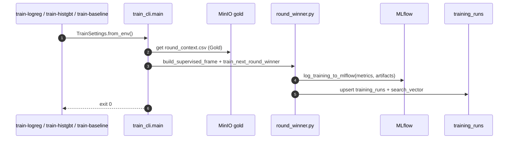

| Script | Modelo |
|--------|--------|
| `train-logreg` | Regressão logística |
| `train-histgbt` | Histogram Gradient Boosting |
| `train-baseline` | Baseline |

**Consumido depois por:** `POST /search/hybrid` (lexical) e `GET /metadata/training`

**Arquivos:** `train_cli.py`, `round_winner.py`, `training_metadata.py`, `lexical_retrieval.py`

---

## 11. Mapa de dependências externas

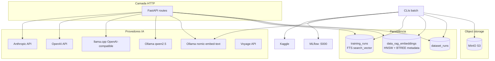

Variáveis principais: `.env` / `AppSettings` (`settings.py`), `MetadataSettings` (`metadata.py`), configs por job (`config.py`).

---

## 12. Índice de arquivos `src/rag_intelligence/`

| Path | Responsabilidade |
|------|------------------|
| `api/main.py` | App factory, routers, lifespan, OTEL |
| `api/deps.py` | Injeção `SettingsDep`, `RegistryDep` |
| `api/middleware.py` | `X-Request-ID`, structlog context |
| `api/routes/health.py` | `GET /health` |
| `api/routes/metadata.py` | `GET /metadata`, `GET /metadata/training` |
| `api/routes/search.py` | `POST /search`, `POST /search/hybrid` |
| `api/routes/rag.py` | `POST /rag/query`, `POST /query` |
| `retrieval.py` | Core semântico — `search_events()` |
| `lexical_retrieval.py` | FTS em `training_runs` |
| `rag.py` | Síntese LlamaIndex — sync + SSE stream |
| `providers.py` | LLM + embedding providers com fallback Ollama |
| `db.py` | PGVectorStore, índices metadata, contrato PB07 |
| `metadata.py` | Catálogo `dataset_runs`, lineage audit |
| `settings.py` | `AppSettings` (API + retrieval) |
| `config.py` | Settings por job (Bronze, Embed, Train, …) |
| `ingest.py` | Download Kaggle → MinIO Bronze |
| `silver.py` / `gold.py` / `documents.py` | Transformações Medallion |
| `embeddings_pipeline.py` | IngestionPipeline → pgvector |
| `embed_docs_cli.py` | Embeddar `docs/pipeline/*.md` |
| `train_cli.py` / `round_winner.py` | Treino ML + MLflow |
| `search_cli.py` | CLI de busca semântica |
| `run_audit_cli.py` | Auditoria de lineage |
| `telemetry.py` | OpenTelemetry (Jaeger/Prometheus) |
| `logging.py` | structlog setup |
| `minio_utils.py` | Helpers MinIO |

---

## 13. Referência rápida — fluxo ponta a ponta (chat demo)

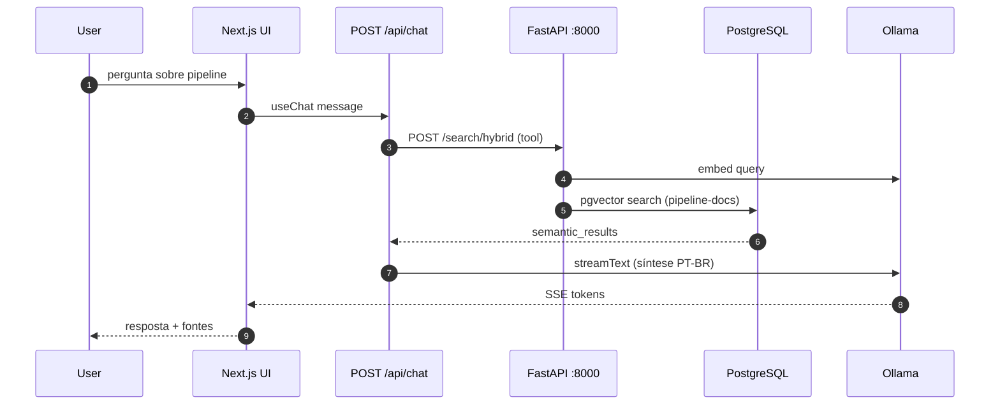

---

*Gerado a partir do código em `src/rag_intelligence/` — alinhar com `http://localhost:8000/docs` ao evoluir rotas.*
