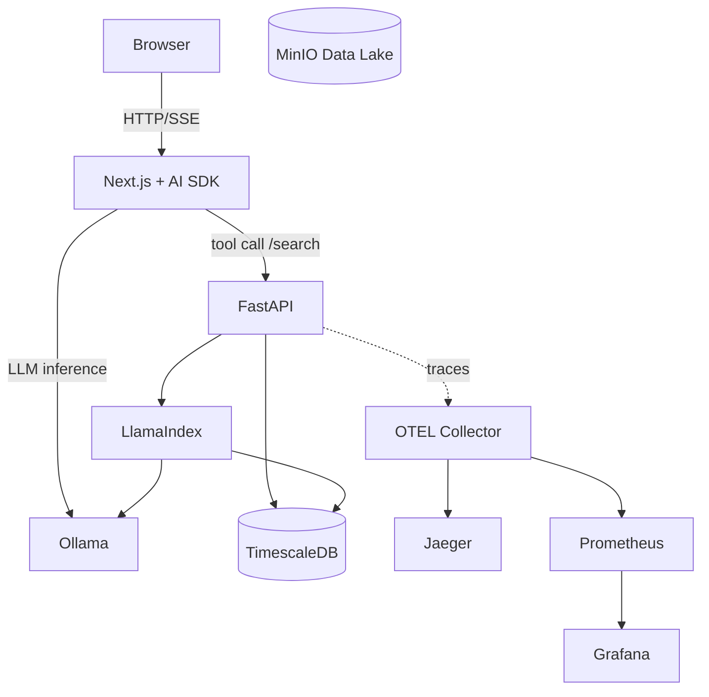
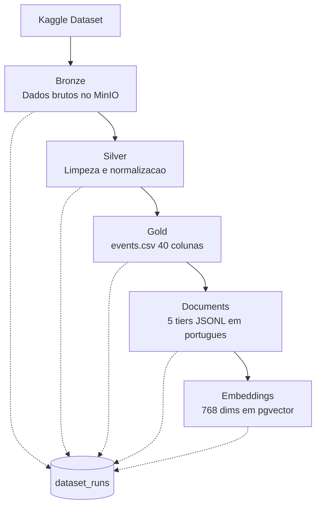
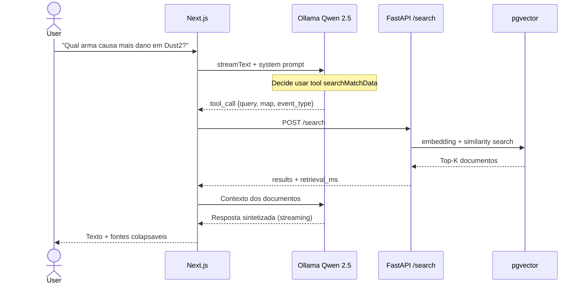
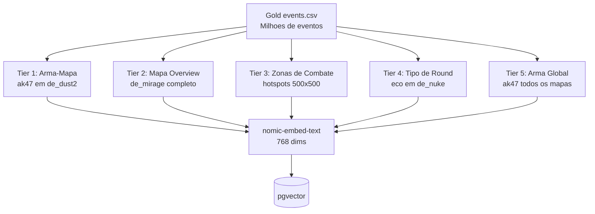
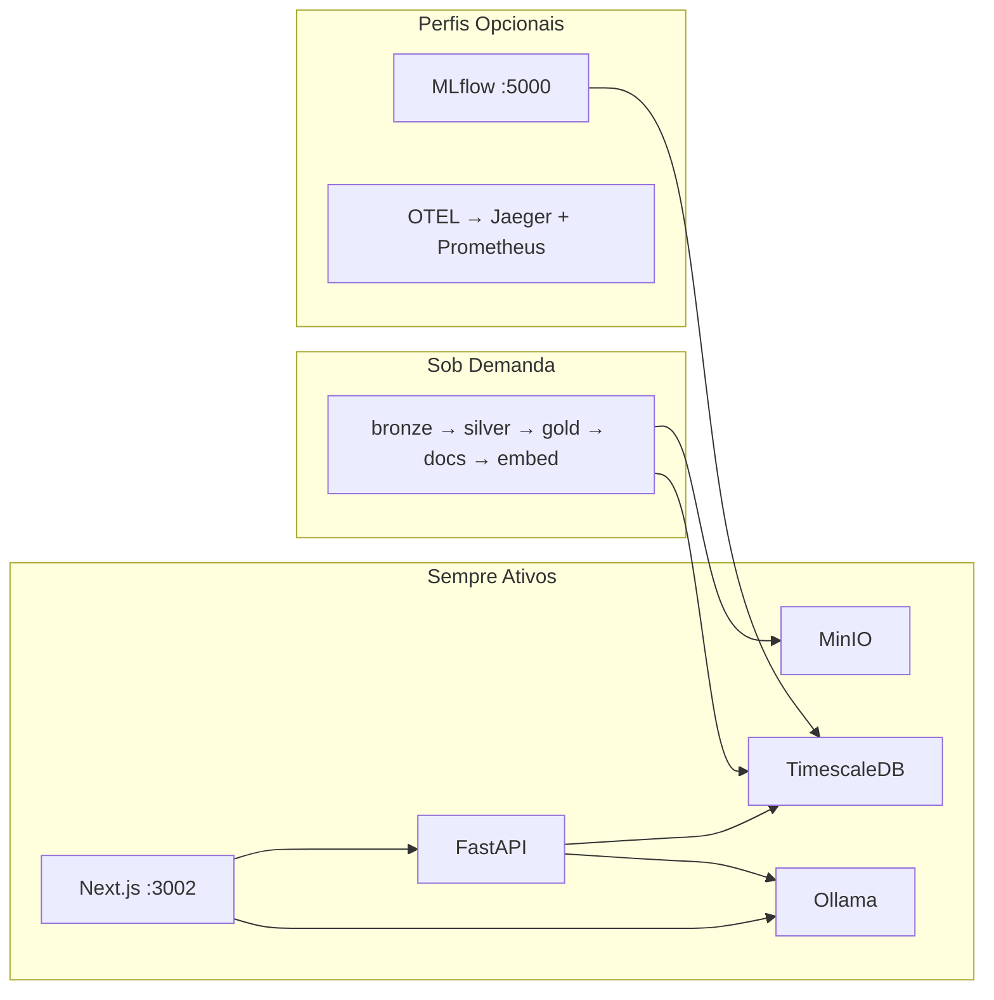
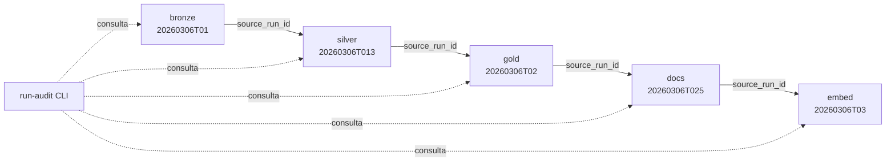

# Diagramas do Projeto

## 1. Arquitetura Geral

```mermaid
flowchart TD
    Browser -->|HTTP/SSE| NextJS[Next.js + AI SDK]
    NextJS -->|tool call /search| FastAPI
    NextJS -->|LLM inference| Ollama

    FastAPI --> pgvector[TimescaleDB + pgvector]
    FastAPI --> LlamaIndex
    LlamaIndex --> Ollama
    LlamaIndex --> pgvector

    MinIO[(MinIO Data Lake)]
    pgvector[(TimescaleDB)]

    FastAPI -.->|traces| OTEL[OTEL Collector]
    OTEL --> Jaeger
    OTEL --> Prometheus --> Grafana
```

## 2. Pipeline Medallion

```mermaid
flowchart TD
    Kaggle[Kaggle Dataset] --> Bronze
    Bronze[Bronze\nDados brutos no MinIO] --> Silver
    Silver[Silver\nLimpeza e normalizacao] --> Gold
    Gold[Gold\nevents.csv 40 colunas] --> Docs
    Docs[Documents\n5 tiers JSONL em portugues] --> Embed
    Embed[Embeddings\n768 dims em pgvector]

    Bronze -.-> Catalog[(dataset_runs)]
    Silver -.-> Catalog
    Gold -.-> Catalog
    Docs -.-> Catalog
    Embed -.-> Catalog
```

## 3. Fluxo RAG

```mermaid
sequenceDiagram
    actor User
    participant FE as Next.js
    participant LLM as Ollama Qwen 2.5
    participant API as FastAPI /search
    participant DB as pgvector

    User->>FE: "Qual arma causa mais dano em Dust2?"
    FE->>LLM: streamText + system prompt
    Note over LLM: Decide usar tool searchMatchData
    LLM-->>FE: tool_call {query, map, event_type}
    FE->>API: POST /search
    API->>DB: embedding + similarity search
    DB-->>API: Top-K documentos
    API-->>FE: results + retrieval_ms
    FE->>LLM: Contexto dos documentos
    LLM-->>FE: Resposta sintetizada (streaming)
    FE-->>User: Texto + fontes colapsaveis
```

## 4. Os 5 Tiers de Documentos

```mermaid
flowchart TD
    Gold[Gold events.csv\nMilhoes de eventos] --> T1 & T2 & T3 & T4 & T5

    T1[Tier 1: Arma-Mapa\nak47 em de_dust2]
    T2[Tier 2: Mapa Overview\nde_mirage completo]
    T3[Tier 3: Zonas de Combate\nhotspots 500x500]
    T4[Tier 4: Tipo de Round\neco em de_nuke]
    T5[Tier 5: Arma Global\nak47 todos os mapas]

    T1 & T2 & T3 & T4 & T5 --> Embed[nomic-embed-text\n768 dims]
    Embed --> PG[(pgvector)]
```

## 5. Servicos Docker

```mermaid
flowchart LR
    subgraph Core[Sempre Ativos]
        MinIO[MinIO]
        TSDB[TimescaleDB]
        Ollama[Ollama]
        API[FastAPI]
        FE[Next.js :3002]
    end

    subgraph Jobs[Sob Demanda]
        pipeline[bronze → silver → gold → docs → embed]
    end

    subgraph Profiles[Perfis Opcionais]
        MLflow[MLflow :5000]
        OTEL[OTEL → Jaeger + Prometheus]
    end

    FE --> API & Ollama
    API --> TSDB & Ollama
    pipeline --> MinIO & TSDB
    MLflow --> TSDB
```

## 6. Rastreabilidade

```mermaid
flowchart LR
    B[bronze\n20260306T01] -->|source_run_id| S[silver\n20260306T013]
    S -->|source_run_id| G[gold\n20260306T02]
    G -->|source_run_id| D[docs\n20260306T025]
    D -->|source_run_id| E[embed\n20260306T03]

    Audit[run-audit CLI] -.->|consulta| B & S & G & D & E
```
