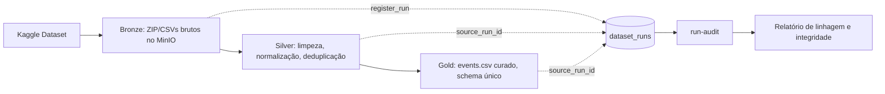
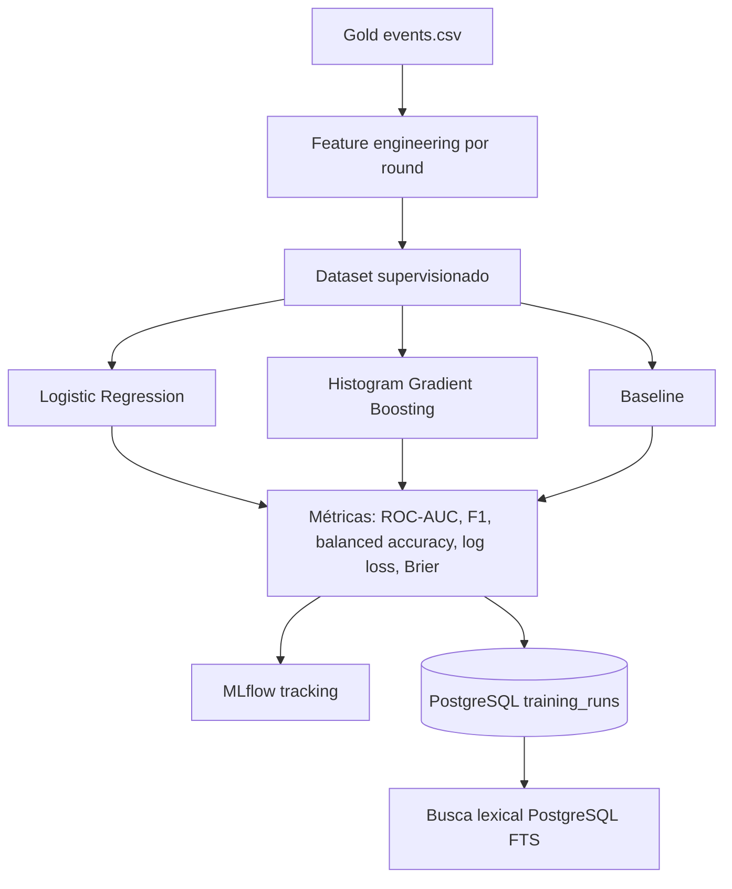
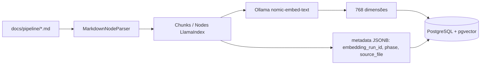
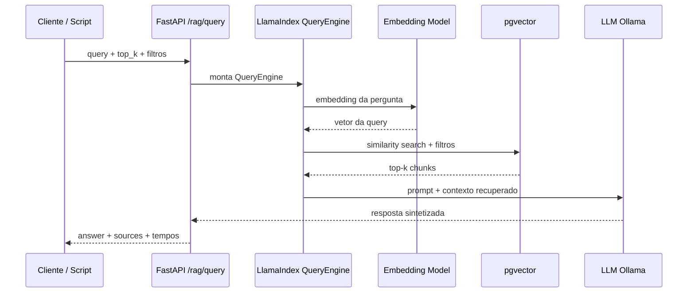
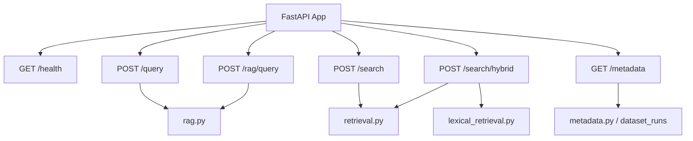
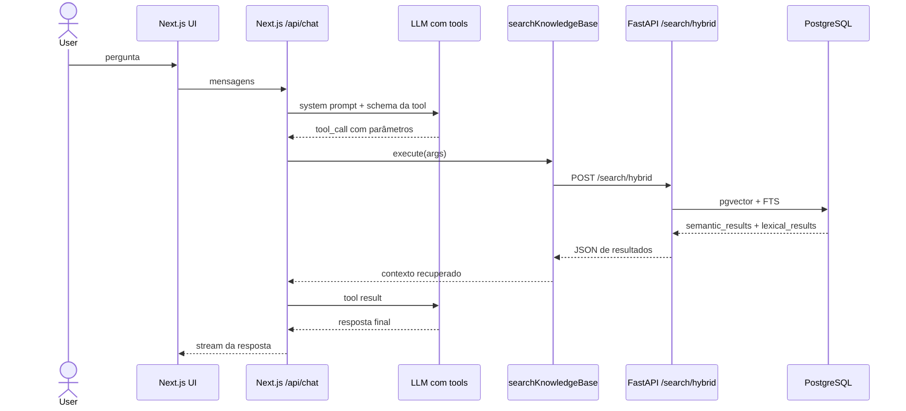

# Checklist de Entregas — Apresentação RAG Intelligence

Este documento mapeia os 8 sprints pedidos pelo professor para entregáveis reais do repositório, com arquivos, comandos e diagramas Mermaid para abrir no VS Code.

---

## Visão executiva

**Domínio:** E-sports / CS:GO analytics  
**Empresa fictícia:** plataforma de inteligência para análise de partidas competitivas de CS:GO  
**Problema de negócio:** permitir que analistas consultem dados de partidas, pipeline e desempenho de modelos por linguagem natural, com governança e rastreabilidade.

**Decisões centrais:**

- Data Lake local em **MinIO**.
- Governança em camadas **Bronze → Silver → Gold**.
- Banco relacional e vetorial em **PostgreSQL/TimescaleDB + pgvector**.
- Busca lexical com **PostgreSQL Full-Text Search**, não DuckDB.
- Embeddings/recuperação semântica com **LlamaIndex + pgvector**.
- LLM e embeddings locais via **Ollama**.
- Tracking de experimentos com **MLflow**.
- API com **FastAPI**.
- Interface com **Next.js + AI SDK tool calling**.

---

## Status por sprint

| Sprint | Requisito | Evidência no projeto | Status |
|---|---|---|---|
| 1 | Domínio, empresa fictícia, problema, requisitos, papéis Scrum | `README.md`, `docs/project-overview.md`, este documento | Feito |
| 2 | Arquitetura geral, diagrama, Docker Compose, MinIO e PostgreSQL | `docker-compose.yml`, `docs/diagrams/README.md`, diagramas abaixo | Feito |
| 3 | Bronze/Silver/Gold, ingestão, versionamento MinIO, governança | `src/rag_intelligence/cli.py`, `silver.py`, `gold.py`, `metadata.py`, CLIs no `pyproject.toml` | Feito |
| 4 | Problema ML, modelos, scripts de treino, MLflow | `round_winner.py`, `train_cli.py`, `Dockerfile.train`, serviços `train-*` no Compose | Feito |
| 5 | Banco vetorial, Ollama, embeddings, indexação, Makefile | `db.py`, `embed_docs_cli.py`, `embeddings.py`, `Makefile`, `PGVectorStore` | Feito |
| 6 | Busca vetorial, prompt, LLM, RAG via script/backend | `retrieval.py`, `rag.py`, `search_cli.py`, `/rag/query` | Feito |
| 7 | FastAPI, endpoints `/query` e `/metadata`, validação input/output | `api/main.py`, `api/routes/rag.py`, `api/routes/metadata.py`, testes | Feito |
| 8 | Interface funcional | `frontend/src/app/api/chat/route.ts`, `frontend/src/components/chat/*` | Feito |

---

## Sprint 1 — Domínio e problema

### O que falar

Escolhemos o domínio de **CS:GO analytics** porque o dataset tem eventos reais de partidas: dano, kills, granadas e metadados de rounds. A empresa fictícia é uma plataforma para analistas de e-sports consultarem estatísticas e explicações por chat.

### Problema de negócio

Analistas precisam transformar milhões de eventos de partidas em respostas úteis, como:

- quais armas performam melhor por mapa;
- como funciona o pipeline de dados;
- qual modelo de ML teve melhor métrica;
- quais features influenciaram a previsão do vencedor do próximo round.

---

## Sprint 2 — Arquitetura e Docker Compose

### Evidências

- `docker-compose.yml`
- `Makefile`
- `docs/diagrams/README.md`
- `docs/pipeline/05-architecture.md`

### Mermaid — arquitetura geral

```mermaid
flowchart TB
    User[Usuário] --> FE[Next.js Chat]

    subgraph BFF[Next.js BFF]
        ChatRoute[/api/chat/route.ts]
        Tool[Tool: searchKnowledgeBase]
    end

    FE --> ChatRoute
    ChatRoute --> Tool
    ChatRoute --> LLM[Ollama / Chat Model]

    subgraph API[FastAPI]
        Query[/query e /rag/query]
        Metadata[/metadata]
        Search[/search e /search/hybrid]
    end

    Tool -->|POST /search/hybrid| Search
    FE -->|opcional| Query
    FE -->|opcional| Metadata

    subgraph Storage[PostgreSQL / TimescaleDB]
        PGVector[(pgvector: embeddings + texto + metadata JSONB)]
        FTS[(training_runs: métricas + tsvector)]
        Runs[(dataset_runs: governança e linhagem)]
    end

    Search --> PGVector
    Search --> FTS
    Query --> PGVector
    Metadata --> Runs

    subgraph Lake[MinIO Data Lake]
        Bronze[Bronze]
        Silver[Silver]
        Gold[Gold]
    end

    Bronze --> Silver --> Gold
    Gold -. artefatos .-> Runs
    LLM -. resposta .-> ChatRoute
    ChatRoute -. streaming .-> FE
```

### Resposta curta

> A arquitetura local usa Docker Compose para subir MinIO, PostgreSQL/TimescaleDB, Ollama, FastAPI, frontend, MLflow e observabilidade opcional. O PostgreSQL centraliza três responsabilidades: metadados de governança, busca lexical e busca vetorial com pgvector.

---

## Sprint 3 — Bronze / Silver / Gold e governança

### Evidências

- Bronze: `src/rag_intelligence/cli.py`
- Silver: `src/rag_intelligence/silver.py`, `silver_cli.py`
- Gold: `src/rag_intelligence/gold.py`, `gold_cli.py`
- Metadata/linhagem: `src/rag_intelligence/metadata.py`
- Auditoria: `src/rag_intelligence/run_audit_cli.py`

### Mermaid — Medallion + linhagem



### O que falar

> Cada etapa gera artefatos no MinIO e registra metadados no PostgreSQL. A tabela `dataset_runs` guarda `run_id`, `stage`, `source_run_id`, contadores de linhas, arquivos processados e `quality_summary`. Isso permite rastrear a origem dos dados e auditar a cadeia Bronze → Silver → Gold.

---

## Sprint 4 — ML e MLflow

### Evidências

- `src/rag_intelligence/round_winner.py`
- `src/rag_intelligence/train_cli.py`
- `src/rag_intelligence/training_metadata.py`
- `Dockerfile.train`
- serviços `train-logreg`, `train-histgbt`, `train-baseline` em `docker-compose.yml`

### Problema de ML

**Classificação supervisionada:** prever o vencedor do próximo round (`winner_side_next_round`) com base em features históricas e econômicas da partida.

### Modelos

- baseline;
- logistic regression;
- histogram gradient boosting.

### Mermaid — treinamento



### O que falar

> Depois do treino, registramos os experimentos no MLflow e também persistimos as métricas em `training_runs`, que alimenta a busca lexical do chat.

---

## Sprint 5 — Vetores, Ollama e indexação

### Evidências

- `src/rag_intelligence/db.py`
- `src/rag_intelligence/embed_docs_cli.py`
- `src/rag_intelligence/embeddings.py`
- `src/rag_intelligence/providers.py`
- `Makefile`: alvo `embed-docs`

### Mermaid — indexação vetorial atual



### O que falar

> O requisito permitia Milvus ou outro banco vetorial com justificativa. Usamos pgvector porque simplifica a stack: o mesmo PostgreSQL guarda vetores, metadados, FTS e governança. O índice vetorial usa HNSW e distância de cosseno.

---

## Sprint 6 — Busca vetorial, prompt e RAG

### Evidências

- `src/rag_intelligence/retrieval.py`
- `src/rag_intelligence/rag.py`
- `src/rag_intelligence/search_cli.py`
- `src/rag_intelligence/api/routes/search.py`

### Mermaid — RAG backend



### O que falar

> A busca vetorial transforma a pergunta em embedding, consulta pgvector por similaridade de cosseno, recupera os chunks mais relevantes e usa esses chunks como contexto para o LLM.

---

## Sprint 7 — FastAPI `/query` e `/metadata`

### Evidências

- `src/rag_intelligence/api/main.py`
- `src/rag_intelligence/api/routes/rag.py`
- `src/rag_intelligence/api/routes/metadata.py`
- `tests/test_rag_endpoint.py`
- `tests/test_metadata_endpoint.py`

### Endpoints principais

| Endpoint | Função |
|---|---|
| `GET /health` | health check |
| `POST /query` | alias de apresentação para RAG completo |
| `POST /rag/query` | RAG completo com opção de streaming |
| `POST /search` | busca vetorial pura |
| `POST /search/hybrid` | busca semântica + lexical |
| `GET /metadata` | metadados do serviço |
| `GET /metadata?stage=gold` | último run de uma etapa |
| `GET /metadata?stage=gold&run_id=...` | metadados de um run específico |
| `GET /metadata?stage=embeddings&run_id=...&lineage=true` | linhagem upstream |

### Mermaid — API



### O que falar

> A API tem validação de entrada via Pydantic/FastAPI. `/query` e `/rag/query` recebem `query`, `top_k`, filtros e modo streaming. `/metadata` expõe informações do serviço, runs e linhagem para comprovar governança.

---

## Sprint 8 — Interface

### Evidências

- `frontend/src/app/api/chat/route.ts`
- `frontend/src/components/chat/*`
- `frontend/src/lib/chat-models.ts`

### Mermaid — tool calling no BFF Next.js



### O que falar

> O agente de chat está no BFF do Next.js. O modelo recebe a descrição da tool e o schema dos parâmetros. Quando decide chamar a tool, o AI SDK executa a função `execute`, que chama o FastAPI `/search/hybrid`. O FastAPI não decide a tool call no fluxo atual; ele fornece a busca.

---

## Busca lexical vs busca densa

```mermaid
flowchart LR
    Question[Pergunta do usuário] --> Hybrid[/search/hybrid]

    Hybrid --> Dense[Busca densa / semântica]
    Dense --> EmbedQuery[Embedding da pergunta]
    EmbedQuery --> PGVec[(pgvector: docs do pipeline)]
    PGVec --> SemanticResults[semantic_results]

    Hybrid --> Lexical[Busca lexical]
    Lexical --> TSQuery[websearch_to_tsquery]
    TSQuery --> TrainingRuns[(training_runs: tsvector + GIN)]
    TrainingRuns --> LexicalResults[lexical_results]

    SemanticResults --> Chat[LLM sintetiza resposta]
    LexicalResults --> Chat
```

### Resposta para DuckDB / FTS5 / BM25

> Não usamos DuckDB. A busca lexical é parecida em objetivo com SQLite FTS5, mas aqui usamos PostgreSQL Full-Text Search. O PostgreSQL usa `tsvector` para representar texto pesquisável, `websearch_to_tsquery` para interpretar a pergunta e `ts_rank` para ordenar por relevância. `ts_rank` tem papel parecido com BM25, mas não é o mesmo algoritmo.

---

## Comandos para demo

```bash
make start
make embed-docs
make train-logreg
make train-histgbt
make train-baseline
```

Interfaces:

- Frontend: `http://localhost:3002`
- API docs: `http://localhost:8000/docs`
- MLflow: `http://localhost:5000`
- MinIO: `http://localhost:9001`

---

## Checklist final para mostrar ao professor

- [x] Domínio e empresa fictícia definidos.
- [x] Arquitetura desenhada em Mermaid.
- [x] Docker Compose funcional.
- [x] MinIO e PostgreSQL configurados.
- [x] Bronze/Silver/Gold implementados.
- [x] Governança com `dataset_runs` e linhagem.
- [x] Problema de ML definido como classificação.
- [x] Modelos treináveis e registrados no MLflow.
- [x] Banco vetorial justificado: pgvector em vez de Milvus.
- [x] Ollama integrado.
- [x] Embeddings e indexação automatizados por Makefile/CLI.
- [x] Busca vetorial implementada.
- [x] Prompt e integração com LLM implementados.
- [x] FastAPI com `/query`, `/rag/query`, `/search`, `/search/hybrid`, `/metadata`.
- [x] Interface funcional em Next.js.
